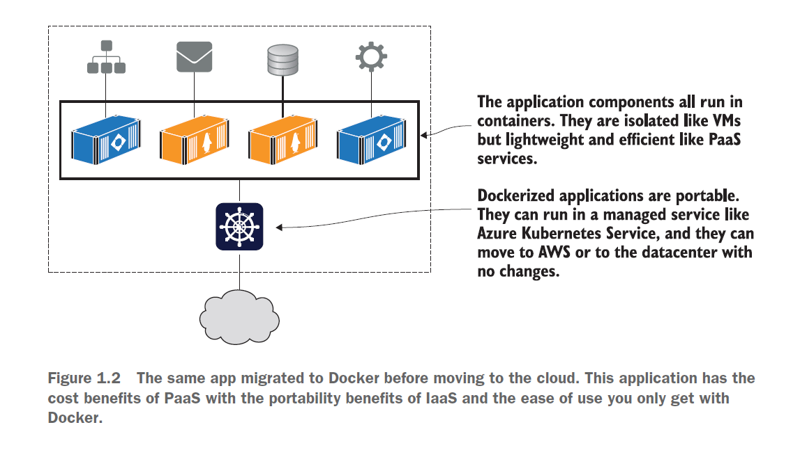

# Intro To Docker

- [Docker Docs](https://docs.docker.com/)

## Containers History
- **Applications are at the heart of businesses**. If applications break, businesses break.
- Most applications run on servers. **In the past we could only run one application per server**.
    - Windows and Linux just didn’t have the technologies to safely and securely run multiple applications on the same server.
- Every time the business needed a new application, the IT department would **buy a new server**. Most of the time **nobody knew the performance requirements** of the new application, forcing the IT department to make guesses when choosing the model and size of the server to buy.
- This resulted in over-powered servers operating as low as 5-10% of their potential capacity. A **tragic waste of company capital and environmental resources**.

### Virtual Machines
- VMware, Inc. gave the world a gift - the virtual machine (VM). IT departments no longer needed to procure a brand-new oversized server every time the business needed a new application.
- VMs aren't perfect:
    - Every VM requires its own dedicated operating system (OS).
    - Every OS consumes CPU, RAM and other resources that could otherwise be used to power more applications.
    - Every OS needs patching and monitoring.
    - And in some cases, every OS requires a license.
    - VMs are slow to boot, and portability isn’t great — migrating and moving VM workloads between hypervisors and cloud platforms is harder than it needs to be.
    - Results in wasted time and resources.

### Containers
- For a long time, the big web-scale players, like Google, have been using container technologies to address the shortcomings of the VM model.
- In the container model, the container is roughly analogous to the VM. A major difference is that **containers do not require their own full-blown OS**. In fact, all containers on a single host share the host’s OS. This frees up huge amounts of system resources such as CPU, RAM, and storage. It also reduces potential licensing costs and reduces the overhead of OS patching and other maintenance.
- **Containers are also fast to start and ultra-portable**. Moving container workloads from your laptop, to the cloud, and then to VMs or bare metal in your data center is a breeze.
- Modern containers started in the Linux world and are the product of an immense amount of work from a wide variety of people over a long period of time.
- Some of the major technologies that enabled the massive growth of containers in recent years include; kernel namespaces, control groups, union filesystem, and of course Docker.

> There are many operating system virtualization technologies similar to containers that predate Docker and modern containers. Some even date back to System/360 on the Mainframe. BSD Jails and Solaris Zones are some other well-known examples of Unix-type container technologies.

- But for now, it’s enough to say that Docker was the magic that made Linux containers usable. Put another way, Docker, Inc. made containers simple!

### Timeline
Container technology has existed for a long time in different forms, but it has significantly gained popularity recently in the Linux world with the introduction of native containerization support in the Linux kernel. System containers are technically the oldest type of containers. 
- 1982: Chroot (Unix-like operating systems)
- 1999: **BSD introduced jails**, a way of running a second BSD system on the same kernel as the main system.
- 2001: Linux implementation of the concept through Linux **vServer**. This was a separate project with a big patch set towards Linux kernel aimed at implementing a functionality similar to BSD jails.
- 2004: Solaris (Sun Solaris, Open Solaris) grew Zones which was the same concept but a part of Solaris OS.
- 2005: OpenVZ project started to implement multiple VPSs (virtual private servers) on Linux.
- 2008: LXC (Linux)
- 2013: Docker (Linux, FreeBSD, Windows)

### Containerization vs traditional virtualization
Virtualization was developed as an effort to **fully utilize available computing resources**. Virtualization enables multiple virtual machines to run on a single host for different purposes with their own isolated space. 

Virtualization achieved such isolated operating system environments using hypervisors, computer software that sits in between the host operating system and the guest or the virtual machine’s operating system.

Containerization differs from traditional virtualization technologies and offers many advantages over traditional virtualization:
- Containers are **lightweight** compared to traditional virtual machines.
- Unlike containers, virtual machines require emulation layers (either software or hardware), which consume more resources and add additional overhead.
- Containers share resources with the underlying host machine, with user space and use process isolation.
- Due to the lightweight nature of containers, more containers can be run per host than virtual machines per host.
- Starting a container happens nearly instantly compared to the slower boot process of virtual machines.
- Containers are portable and can reliably regenerate a system environment with required software packages, irrespective of the underlying host operating system.

## Introduction to Containers
Containerization is the next logical step in virtualization, and there is a huge buzz around this technology. Containers can **provide virtualization at both the operating system level and the application level.**

Some of the possibilities with containers are as follows:
- Provide a complete operating system environment that is sandboxed (isolated)
- Allow packaging and isolation of applications with their entire runtime environment
- Provide a portable and lightweight environment
- Help to maximize resource utilization in data centers
- Aid different development, test, and production deployment workflows

### Container Definition
A **container can be defined as a single operating system image, bundling a set of isolated applications and their dependent resources so that they run separated from the host machine.** There may be multiple such containers running within the same host machine.

Containers can be classified into two types:
- **Operating system level**: An entire operating system runs in an isolated space within the host machine, sharing the same kernel as the host machine.
- **Application level**: An application or service, and the minimal processes required by that application, runs in an isolated space within the host machine.

### What types of containers are there?
- **System containers** (as run by LXD) are similar to virtual or physical machines. They **run a full operating system inside them**, you can run any type of workload, and you manage them exactly as you would a virtual or a physical machine. System containers are usually **long-lasting** and you could host **several applications** within a single system container. That means you can install packages inside them, you can manage services, define backup policies, monitoring, and all other aspects as you usually would with a virtual machine.
- **Application containers** (such as Docker), also known as process containers, are containers that **package and run a single process or a service** per container. They run **stateless types of workloads** that are meant to be ephemeral. This means that these containers are temporary, and you can create, delete and replace containers easily as needed. Usually, you don’t need to care about the lifecycle of those containers.

> A common confusion for potential users of LXD is that LXD is an alternative to Docker or Kubernetes. However, LXD and Docker are not competing container technologies, and they tend to serve completely different purposes.

<!-- Source: https://ubuntu.com/blog/lxd-vs-docker -->

Both application and system containers share a kernel with the host operating system and utilize it to create isolated processes.
- Application containers run a single app/process.
- System containers run a full operating system giving them flexibility for the workload types they support.

## Docker overview
- Docker is an **open platform for developing, shipping, and running applications**. 
- Docker is a platform for running applications in lightweight units called containers.
- Docker enables you to **separate your applications from your infrastructure** so you can deliver software quickly. 
    - With Docker, you can manage your infrastructure in the same ways you manage your applications. 
- By taking advantage of Docker’s methodologies for shipping, testing, and deploying code quickly, you can significantly **reduce the delay between writing code and running it in production**.
- Docker is becoming a core competency
for operators and developers across the industry—in the 2019 Stack Overflow survey, Docker polled as **people’s number one “most wanted” technology**.

### Why are containers and Docker so important?
- **Migrating apps to the cloud**
    - Moving apps to the cloud is top of mind for many organizations. -> Less cost, easier scaling, faster deployment of new applications, no worries about hardware.
    - You migrate each part of your application to a container, and then you can run the whole application in containers using Kubernetes or other cloud services, or on your own Docker cluster in the datacenter.
        - It does take some investment to migrate to containers (Dockerfiles, manifests using the Docker Compose or Kubernetes format.).
    

<!-- Source: Learn Docker in a Month of Lunches, ELTON STONEMAN -->

- **Modernizing legacy apps**
    - You can run pretty much any app in the cloud in a container, but you won’t get the full value of Docker or the cloud platform if it uses an older, monolithic design.
    - Moving your app to Docker is a great first step to modernizing the architecture, adopting new patterns without needing a full rewrite of the app.
    - Benefits of a microservice architecture.
- **Building new cloud-native apps**
    - Brandnew projects built on cloud-native principles are greatly accelerated with Docker.
- **Technical innovation: Serverless and more**
    - One of the key drivers for modern IT is consistency: teams want to use the same tools, processes, and runtime for all their projects.
    - You can run all your applications—legacy monoliths, new cloud-native apps, and serverless functions—on a single Docker cluster, which could be running in the cloud or the datacenter.
- **Docker provides an abstraction**
    - Instead of focusing on all the complexities and specifics associated with installing an application, all we need to consider is what software we’d like to install.
    - This is also the case for application removal.
- **Protecting your computer**
    - Containers also protect us from the software running inside a container.
    - Like physical jail cells, anything inside a container can access only things that are inside it as well. Exceptions to this rule exist, but only when explicitly created by the user.
- **Improving portability**
    - Portability between operating systems is a major problem for software users.
    - Software running in Docker containers need be written only once against a consistent set of dependencies.
        - That means your desktop, your development environment, your company’s server, and your company’s cloud can all run the same programs.
- **Getting organized**
    - Without Docker, a computer can end up looking like a junk drawer. Applications have all sorts of dependencies. Some applications depend on specific system libraries for common things like sound, networking, graphics, and so on. Others depend on standard libraries for the language they’re written in. Some depend on other applications, such as the way a Java program depends on the Java Virtual Machine, or a web application might depend on a database. It’s common for a running program to require exclusive access to a scarce resource such as a network connection or a file.
    - Docker keeps things organized by isolating everything with containers and images.

## Installing Docker

Docker is a set of platform as a service (PaaS) products that use OS-level virtualization to deliver software in packages called containers.

<!-- Source: https://docs.docker.com/ -->

### About Docker Company
Docker is software that runs on Linux and Windows. It creates, manages, and can even orchestrate containers. The software is currently built from various tools **from the Moby open-source project**. Docker, Inc. is the company that created the technology and continues to create technologies and solutions.

Docker, Inc. is a San Francisco based technology company founded by French-born American developer and entrepreneur Solomon Hykes.

It’s also interesting to know that the word “Docker” comes from a British expression meaning dock worker — somebody who loads and unloads cargo from ships.

### Docker Desktop
Docker Desktop is a one-click-install application for your Mac, Linux, or Windows (using Hyper-V or WSL2) environment that lets you build, share, and run containerized applications and microservices.

It provides a straightforward **GUI (Graphical User Interface)** that lets you manage your containers, applications, and images directly from your machine.

Docker Desktop reduces the time spent on complex setups so you can focus on writing code. It takes care of port mappings, file system concerns, and other default settings, and is regularly updated with bug fixes and security updates.

Docker Desktop includes:
- Docker Engine
- Docker CLI client
- Docker Scout (additional subscription may apply)
- Docker Build
- Docker Extensions
- Docker Compose
- Docker Content Trust
- Kubernetes
- Credential Helper

Docker Desktop works with your choice of development tools and languages and gives you access to a vast library of certified images and templates in Docker Hub. This allows development teams to extend their environment to rapidly auto-build, continuously integrate, and collaborate using a secure repository.

> **Update to the Docker Desktop terms**: Commercial use of Docker Desktop at a company of more than 250 employees OR more than $10 million in annual revenue requires a paid subscription (Pro, Team, or Business).

Install Docker Desktop: https://docs.docker.com/get-docker/

### Docker Engine
Docker Engine is an open source (licensed under the Apache License, Version 2.0) containerization technology for building and containerizing your applications. Docker Engine acts as a client-server application with:
- A server with a long-running daemon process **dockerd**.
- APIs which specify interfaces that programs can use to talk to and instruct the **Docker daemon**.
- A command line interface (CLI) **client docker**.

1. [Install Docker Engine on Ubuntu](https://docs.docker.com/engine/install/ubuntu/)
2. [Post-installation steps for Linux](https://docs.docker.com/engine/install/linux-postinstall/)
    - [Optional] Manage Docker as a non-root user -> Security risks! 
    - Configure Docker to start on boot with systemd

> Run the Docker daemon as a non-root user (**[Rootless mode](https://docs.docker.com/engine/security/rootless/)**): Rootless mode allows running the Docker daemon and containers as a non-root user to mitigate potential vulnerabilities in the daemon and the container runtime.

### Differences between Docker Desktop for Linux and Docker Engine

[Docker Desktop for Linux and Docker Engine](https://docs.docker.com/desktop/install/linux-install/#differences-between-docker-desktop-for-linux-and-docker-engine) can be installed side-by-side on the same machine. Docker Desktop for Linux stores containers and images in an isolated storage location within a VM and offers controls to restrict its resources. Using a dedicated storage location for Docker Desktop prevents it from interfering with a Docker Engine installation on the same machine.

### Verifying your Docker setup
First check Docker itself with the docker version command:
- `sudo docker version`

## Running Hello World in a container
You’re going to send a command to Docker, telling it to run a container that
prints out some simple “Hello, World” text.

Enter this command, which will run the Hello World container: `sudo docker container run hello-world` or `sudo docker run hello-world`

> Both commands are exactly the same. Prior to docker 1.13 the docker run command was only available. The CLI commands were then refactored to have the form docker COMMAND SUBCOMMAND, wherein this case the COMMAND is container and the SUBCOMMAND is run.

1. The docker container run command tells Docker to run an application in a container. 
2. This application has already been packaged to run in Docker and has been published on a public site that anyone can access.
3. The container package (which Docker calls an “image”) is named hello-world.
4. The command you’ve just entered tells Docker to run a container from that image.
5. After the echo command prints "hello world" to the terminal, the program exits, and the container is marked as stopped.

Run and check for a container:
- List all running container processes: `sudo docker ps`
- `sudo docker ps -a` (List all containers, running and stopped)

Docker needs to have a copy of the image locally before it can run a container
using the image. The very first time you run this command, you won’t have a copy of the image, and you can see that in the first output line: `unable to find image locally`. Then Docker downloads the image (which Docker calls “pulling”), and you can see that the image has been downloaded.

Now Docker starts a container using that image. The image contains all the content for the application, along with instructions telling Docker how to start the application. The application in this image is just a simple script.

And Docker images can be packaged to **run on any computer that supports Docker**, which makes the app completely portable — **portability is one of Docker’s key benefits.**

Repeat the exact same Docker command: `sudo docker run hello-world`

Docker already has a copy of the image locally so it doesn’t need to download the image first; it gets straight to running the container.

When you use docker run the second time, it creates a second container from the same repository. This means that if you repeatedly use docker run and create a bunch of containers, you’ll need to get a list of the containers you’ve created and maybe at some point destroy them.

Run and check for a container:
- `sudo docker ps -a`

Understand that the running state of a container is directly tied to the state of a single running program inside the container. **If a program is running, the container is running. If the program is stopped, the container is stopped.** Restarting a container will run the program again.

Clean: `sudo docker container rm -f $(sudo docker container ls -aq)`

## Example: Running multiple NGINX instances
1. Check if there is already a server running on the virtual machine:
    - Verify functionality: `curl http://127.0.0.1 or the VM's IP`
2. Install and test the functionality of an NGINX instance:
    - `sudo apt update`
    - `sudo apt install -y nginx`
    - `nginx -v`
    - `sudo systemctl start nginx`
    - `sudo systemctl status nginx`
    - Verify functionality: `curl http://127.0.0.1 or the VM's IP`
3. Attempt to install two NGINX instances:
    - `sudo apt install nginx` -> already exists
    - `sudo systemctl start nginx` -> still only one instance is running
    - `sudo ps aux | grep nginx`
    - To install two instances, we would need to modify the init scripts. This is a complicated task and nearly impossible for two different versions.
    - Stop the service:
        - `sudo systemctl stop nginx`
        - `sudo systemctl disable nginx`
        - `sudo apt remove nginx`
    - The issue is that when we install one version, the dependencies differ between versions. Containers simplify this process.
4. Run NGINX using Docker:
    - NGINX DockerHub: https://hub.docker.com/_/nginx
    - Pull the image locally (this step is optional; if the image is not available, it will be downloaded automatically during startup): `sudo docker pull nginx`
        - Use the default `latest` tag
        - Start the first instance: `sudo docker run -d nginx`
        - Check if it is running: `sudo docker ps`
        - Demonstrate that we cannot yet connect to the instance.
        - Start the second and third versions of NGINX:
            - `sudo docker run -d nginx:1.22.0`
            - `sudo docker run -d nginx:1.14.0`
        - Check if they are running: `sudo docker ps`
        - Show that the process is visible on the host: `sudo ps aux | grep nginx`

> If you don't specify a name, Docker gives a container a random name, such as "stoic_williams," "sharp_bartik," "awesome_murdock," or "evil_hawking." (Stephen Hawking got no love on this one.) These are generated from a list of adjectives and names of famous scientists and hackers. The combination of the names and adjectives is random, except for one case. Want to see what the exception is? Check it out in the [Docker source code](https://github.com/docker/docker/blob/master/pkg/namesgenerator/names-generator.go)

5. Expose the container to the internet:
    - `sudo docker run -d -p "80:80" nginx`
    - Check if it is running: `sudo docker ps`
    - Verify functionality: `curl http://127.0.0.1 or the VM's IP`
6. Clean: `sudo docker container rm -f $(sudo docker container ls -aq)`

## Docker Architecture
Docker is **written in the Go programming language** and takes advantage of several features of the Linux kernel to deliver its functionality. Docker uses a technology called **namespaces** to provide the isolated workspace called the container. When you run a container, Docker creates a set of namespaces for that container.

These namespaces provide a layer of isolation. Each aspect of a container runs in a separate namespace and its access is limited to that namespace.

Docker uses a **client-server architecture**. 

The Docker client talks to the Docker daemon, which does the heavy lifting of building, running, and distributing your Docker containers. 

The Docker client and daemon can run on the same system, or you can connect a Docker client to a remote Docker daemon. The Docker client and daemon communicate using a REST API, over UNIX sockets or a network interface.

In a default Linux installation, the client talks to the daemon via a local IPC/Unix socket at `/var/run/docker.sock`.

Another Docker client is Docker Compose, that lets you work with applications consisting of a set of containers.

<!-- Source: https://docs.docker.com/get-started/overview/ -->

A Docker registry stores Docker images. Docker Hub is a public registry that anyone can use, and Docker looks for images on Docker Hub by default. You can even run your own private registry.

When you use the `docker pull` or `docker run` commands, Docker pulls the required images from your configured registry. When you use the `docker push` command, Docker pushes your image to your configured registry.

<!-- Source: Docker Deep Dive, Nigel Poulton -->

- The **runtime** operates at the lowest level and is responsible for starting and stopping containers (this includes building all of the OS constructs such as namespaces and cgroups). Docker implements a tiered runtime architecture with high-level and low-level runtimes that work together.
    - The **low-level runtime** is called `runc` and is the reference implementation of Open Containers Initiative (OCI) runtime-spec. Its job is to interface with the underlying OS and start and stop containers. Every running container on a Docker node has a runc instance managing it.
    - The **higher-level runtime** is called `containerd`. containerd does a lot more than runc. It manages the entire lifecycle of a container, including pulling images, creating network interfaces, and managing lower-level runc instances. containerd is pronounced “container-dee’ and is a graduated CNCF project used by Docker and Kubernetes as a container runtime. A typical Docker installation has a single containerd process (docker-containerd) controlling the runc (dockerrunc) instances associated with each running container.
- The **Docker daemon** (`dockerd`) sits above containerd and performs higher-level tasks such as; exposing the Docker remote API, managing images, managing volumes, managing networks, and more… A major job of the Docker daemon is to provide an easy-to-use standard interface that abstracts the lower levels.
- Docker also has native support for managing clusters of nodes running Docker. These clusters are called swarms and the native technology is called **Docker Swarm**. Docker Swarm is easy-to-use and many companies are using it in real-world production. However, most people are choosing to use Kubernetes instead of Docker Swarm.

## The Docker Engine (Advanced)

More [here](./The_Docker_Engine_Advanced.md).
