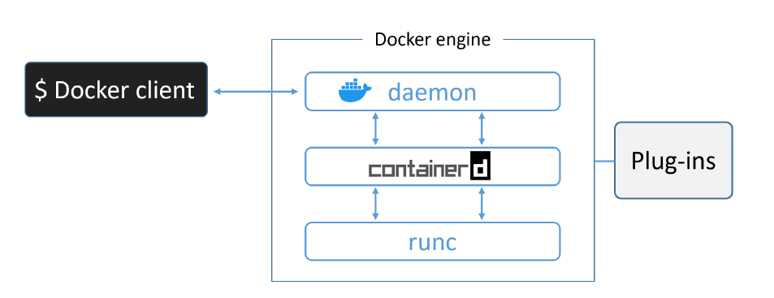
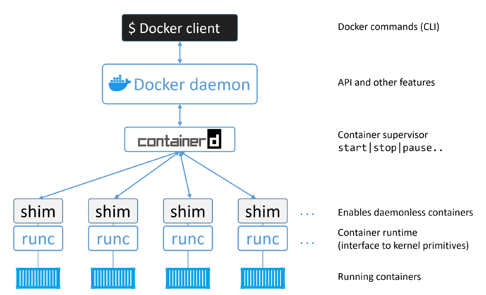

# The Docker Engine (Advanced)

The Docker engine is the core software that runs and manages containers. We often refer to it simply as Docker. If you know a thing or two about VMware, it might be useful to think of it as being like ESXi.

The Docker engine is modular in design and built from many small specialised tools. Where possible, these are based on open standards such as those maintained by the Open Container Initiative (OCI).

The major components that make up the Docker engine are; the **Docker daemon**, **containerd, runc**, and various plugins such as networking and storage. Together, these create and run containers.

<!-- Vir: Docker Deep Dive, Nigel Poulton -->

A high-level view of the current Docker engine architecture with brief descriptions.

<!-- Vir: Docker Deep Dive, Nigel Poulton -->

As of Docker 1.11 (early 2016), the Docker engine implements the **OCI specifications** as closely as possible. For example, the Docker daemon no longer contains any container runtime code — all container runtime code is implemented in a separate OCI-compliant layer. By default, Docker uses runc for this. runc is the reference implementation of the OCI container-runtime-spec.

As well as this, the containerd component of the Docker Engine makes sure Docker images are presented to runc as valid OCI bundles.

## runc

As previously mentioned, runc is the reference implementation of the OCI container-runtime-spec. Docker, Inc. was heavily involved in defining the spec and developing runc. 

If you strip everything else away, runc is a small, lightweight CLI wrapper for libcontainer (remember that libcontainer originally replaced LXC as the interface layer with the host OS in the early Docker architecture).

runc has a single purpose in life — create containers. And it’s damn good at it. And fast! But as it’s a CLI wrapper, it’s effectively a standalone container runtime tool. This means you can download and build the binary, and you’ll have everything you need to build and play with runc (OCI) containers. 

But it’s bare bones and very low-level, meaning you’ll have none of the richness that you get with the full-blown Docker engine. We sometimes call the layer that runc operates at, “the OCI layer”.

## containerd

As part of the effort to strip functionality out of the Docker daemon, all of the **container execution logic** was ripped out and refactored into a new tool called `containerd` (pronounced container-dee). Its sole purpose in life was to manage container lifecycle operations — start | stop | pause | rm....

containerd is available as a daemon for Linux and Windows, and Docker has been using it on Linux since the 1.11 release. In the Docker engine stack, containerd sits between the daemon and runc at the OCI layer.

As previously stated, containerd was originally intended to be small, lightweight, and designed for a single task in life — container lifecycle operations. However, over time it has branched out and taken on more functionality. Things like image pulls, volumes and networks.

One of the reasons for adding more functionality is to make it easier to use in other projects. For example, in projects like Kubernetes, it was beneficial for containerd to do additional things like push and pull images. For these reasons, containerd now does a lot more than simple container lifecycle management. However, all the extra functionality is modular and optional, meaning you can pick and choose which bits you want. So, it’s possible to include containerd in projects such as Kubernetes, but only to take the pieces your project needs.

containerd was developed by Docker, Inc. and donated to the Cloud Native Computing Foundation (CNCF). Containerd is a fully graduated CNCF project, meaning it’s stable and considered ready for production.

## shim
The shim is integral to the implementation of daemonless containers.

Containerd uses runc to create new containers. In fact, it forks a new instance of runc for every container it creates. However, once each container is created, the parent runc process exits. This means we can run hundreds of containers without having to run hundreds of runc instances.

Once a container’s parent runc process exits, the associated containerd-shim process becomes the container’s parent. Some of the responsibilities the shim performs as a container’s parent include:
- Keeping any STDIN and STDOUT streams open so that when the daemon is restarted, the container doesn’t terminate due to pipes being closed etc.
- Reports the container’s exit status back to the daemon.

## Docker deamon

Some of the major functionality that still exists in the daemon includes; image management, image builds, the REST API, authentication, security, core networking, and orchestration.

## Resources
- [How does Docker run Containers Under the Hood](https://tbhaxor.com/how-do-docker-run-containers-under-the-hood/)
