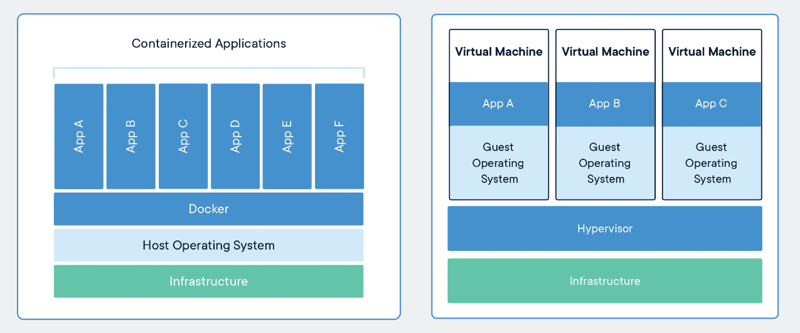
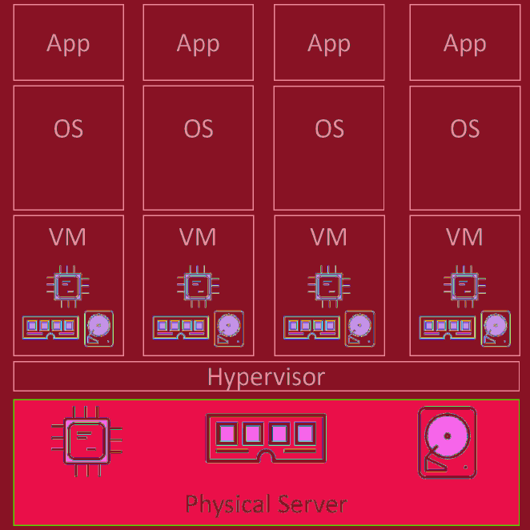
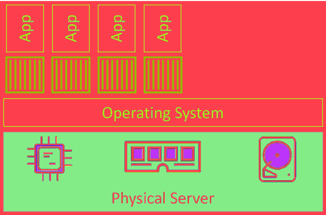
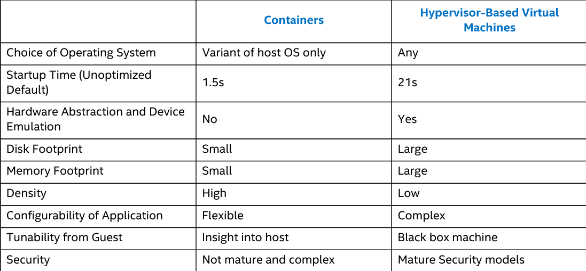
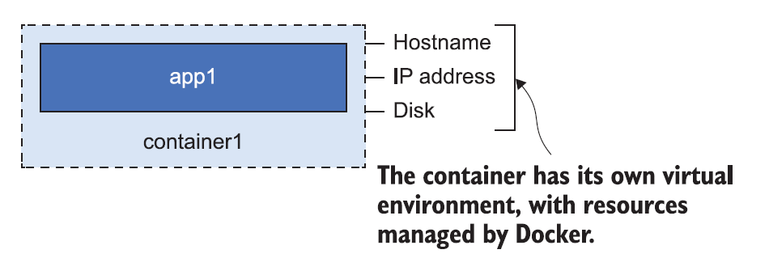
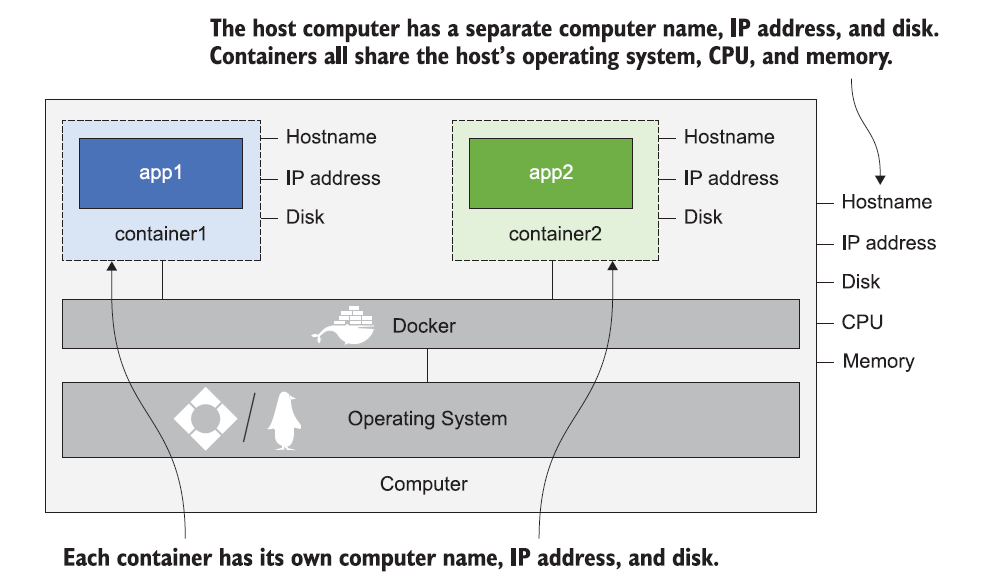
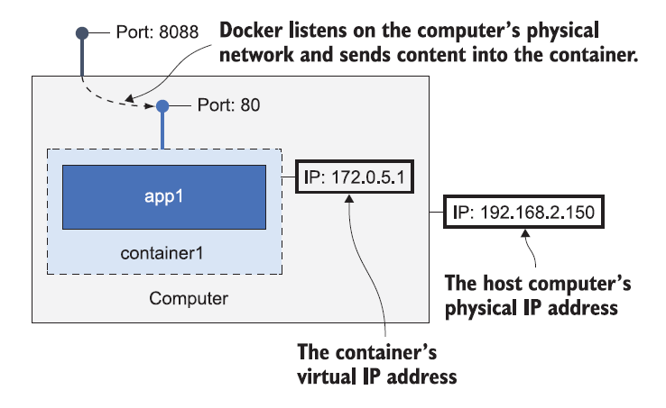

# Containers

## Containers vs Virtual Machines

<!-- Source: https://www.docker.com/resources/what-container/ -->

**Containers and VMs both need a host to run on.** This can be anything from your laptop, a bare metal server in your data center, all the way up to an instance in the public cloud. In fact, many cloud services now offer the ability to run containers on ephemeral serverless back-ends.

In the **VM model**:
1. The physical server is powered on and the hypervisor boots (we’re skipping the BIOS and bootloader code etc.). 
2. Once booted, the hypervisor lays claim to all physical resources on the system such as CPU, RAM, storage, and NICs. 
3. It then carves these hardware resources into virtual versions that look smell and feel exactly like the real thing. 
4. It then packages them into a software construct called a virtual machine (VM). 
5. We take those VMs and install an operating system and application on each one.

Things are a bit different in the **container model**:
1. The server is powered on and the OS boots. In the Docker world this can be Linux, or a modern version of Windows that supports the container primitives in its kernel. 
2. Similar to the VM model, the OS claims all hardware resources. 
3. On top of the OS, we install a container engine such as Docker. 
4. The container engine then takes OS resources such as the process tree, the filesystem, and the network stack, and carves them into isolated constructs
called containers. 
5. Each container looks smells and feels just like a real OS. 
6. Inside of each container we run an application.

At a high level, **hypervisors perform hardware virtualization** — they carve up physical hardware resources into virtual versions called VMs. On the other hand, **containers perform OS virtualization** — they carve OS resources
into virtual versions called containers.

**Example**
- Let’s assume a requirement where your business has a single physical server that needs to run 4 business applications.
- We’d create 4 VMs, install 4 operating systems, and then install the 4 applications.

<!-- Source: Docker Deep Dive, Nigel Poulton -->

- We’d carve the OS into 4 containers and run a single application inside each.

<!-- Source: Docker Deep Dive, Nigel Poulton -->

The container model has a single OS/kernel running on the host. It’s possible to run tens or hundreds of containers on a single host with every container sharing that single OS/kernel. That means a single OS consuming CPU, RAM, and storage. A single OS that needs licensing. A single OS that needs updating and patching. And a single OS kernel presenting an attack surface.

As a container isn’t a full-blown OS, it **starts much faster than a VM**. Remember, there’s no kernel inside of a container that needs locating, decompressing, and initializing — not to mention all of the hardware enumerating and initializing associated with a normal kernel bootstrap.

None of that is needed when starting a container. The **single shared kernel, running on the host machine**, is already started. Net result, containers can start in less than a second. The only thing that has an impact on container start time is the time it takes to start the application it’s running.

You can pack more applications onto less resources, start them faster, and pay less in licensing and admin costs, as well as present less of an attack surface to the dark side.

Well, one thing that’s not so great about the container model is security. Out of the box, containers are less secure and provide less workload isolation than VMs. Technologies exist to secure containers and lock them down, but
at the time of writing, some of them are prohibitively complex.

## What is a container?
A Docker container is the same idea as a physical container — think of it like a box with an application in it. Inside the box, the application seems to have a computer all to itself: it has its **own machine name** and **IP address**, and it also has its **own disk drive** (Windows containers have their own Windows Registry too).

<!-- Source: Learn Docker in a Month of Lunches, ELTON STONEMAN -->

- Those things are all **virtual resources**—the hostname, IP address, and filesystem are created by Docker. They’re logical objects that are managed by Docker, and they’re all joined together to create an environment where an application can run.
- **The application inside the box can’t see anything outside the box**, but the box is running on a computer, and that computer **can also be running lots of other boxes**.
- The applications in those boxes have their own separate environments (managed by Docker), but they **all share the CPU and memory of the computer**, and they all **share the computer’s operating system**.

<!-- Source: Learn Docker in a Month of Lunches, ELTON STONEMAN -->

It fixes two conflicting problems in computing: 
- **Density**
    - Density means running as many applications on your computers as possible, to utilize all the processor and memory that you have.
- **Isolation**
    - Applications really need to be isolated from each other, and that stops you running lots of them on a single computer, so you don’t get density.

## Starting a simple container

The simplest way to start a container is with the `docker container run` command. The following command starts a simple container that will run a containerized version of Ubuntu Linux. You can run a container and connect to a terminal inside the container, just as if you were connecting to a remote machine.

- `sudo docker run -it ubuntu:latest /bin/bash`

same as

- `sudo docker container run --interactive --tty ubuntu:latest /bin/bash`

The `--interactive` or `-i` flag tells Docker you want to set up a connection to the container, and the `--tty` or `t` flag means you want to connect to a terminal session inside the container. `/bin/bash` is the application the container will run.

The output will show Docker pulling the image, and then you’ll be left with a
command prompt. That command prompt is for a terminal session inside the container.

> When you hit Return, the Docker client packaged up the command and POSTed it to the API server running on the Docker daemon. The Docker daemon accepted the command and searched the Docker host’s local image repository to see if it already had a copy of the requested image. It didn’t, so it went to Docker Hub to see if it could find it there. It found it, pulled it locally, and stored it in its local cache. Once the image was pulled, the daemon instructed containerd and runc to create and start the container.

Either way, you’re now inside the container and you can run any commands that you can normally run in the command line for the operating system. Run the commands hostname and date and you’ll see details of
the container’s environment:
- `hostname` (first 12 characters of the container’s unique ID)
- `date`

Try executing some basic commands inside of the container. You might notice that some of them don’t work. This is because the **images are optimized to be lightweight**. As a result, they don’t have all of the normal commands
and packages installed. The following example shows a couple of commands — one succeeds and the other one fails.
- `ls -l`
- `ping google.com`

As you can see, the ping utility is not included as part of the official Ubuntu image. We can install the command:
- `apt update`
- `apt install -y iputils-ping`
- `ping google.com`

Open up a new terminal session, and you can **get details of all the running containers** with this command: `sudo docker container ls`

The output shows you information about each container, including the image it’s using, the container ID, and the command Docker ran inside the container when it started.

`docker container top` lists the processes running in the container.
- `sudo docker container top <CONTAINER ID or NAME>`

If you have multiple processes running in the container, Docker will show them all.

- `docker container logs` displays any log entries the container has collected:
- `sudo docker container logs <CONTAINER ID or NAME>`

Docker collects log entries using the output from the application in the container. In the case of this terminal session, I see the commands I ran and their results, but for a **real application you would see your code’s log entries**. For example, a web application may write a log entry for every HTTP request processed, and these will show in the container logs.

`docker container inspect` shows you all the details of a container:
- `sudo docker container inspect <CONTAINER ID or NAME>`

The full output shows lots of low-level information, including the paths of the container’s virtual filesystem, the command running inside the container, and the virtual Docker network the container is connected to—this can all be useful if you’re tracking down a problem with your application. It comes as a large chunk of JSON, which is great for automating with scripts. 

## Container processes
When we started the Ubuntu container, we told it to run the Bash shell (/bin/bash). This makes the Bash shell the **one and only process running** inside of the container. You can see this by running `ps -elf` from inside the container.
- Run inside the container: `ps -elf`

The first process in the list, with PID 1, is the Bash shell we told the container to run. The second process is the `ps -elf` command we ran to produce the list. This is a **short-lived process that exits as soon as the output is displayed**. Long story short, this container is running a single process — `/bin/bash`.

If you’re logged on to the container and type exit, you’ll terminate the Bash process and the container will exit (terminate). This is because a container cannot exist without its designated main process. This is true of Linux and Windows containers — **killing the main process in the container will kill the container**.

Press `Ctrl-PQ` to **exit the container without terminating its main process**. Doing this will place you back in the shell of your Docker host and leave the container running in the background. You can use the `docker container ls` command to view the list of running containers on your system.

It’s important to understand that **this container is still running and you can re-attach your terminal to it with**: the `docker container attach` command.
- `sudo docker attach <CONTAINER ID or NAME>`
- Run inside the container: `ps -elf` (we see one bash shell)
- Press `Ctrl-PQ`

Re-attach your terminal to it with the `docker container exec` command.
- `sudo docker container exec -it <CONTAINER ID or NAME> bash`
- Run inside the container: `ps -elf` (we see two bash shells)

As you can see, the shell prompt has changed bach to the container. If you run the `ps -elf` command again you will now see two Bash or PowerShell processes. This is because the **docker container exec command created a new Bash or PowerShell process** and attached to that. **This means typing exit in this shell will not terminate the container**, because the original Bash or PowerShell process will continue running.
- `exit`
- `sudo docker container ls`

If you are following along with the examples, you should stop and delete the container with the following two commands (you will need to substitute the ID of your container).
- `sudo docker container stop <CONTAINER ID or NAME>`
- `sudo docker container ls -a`

The containers have the status Exited. There are a couple of key things to understand here. First, containers are running only while the application inside the container is running. As soon as the application process ends, the container goes into the exited state. **Exited containers don’t use any CPU time or memory.**

Second, **containers don’t disappear when they exit**. Containers in the exited state still exist, which means you can start them again, check the logs, and copy files to and from the container’s filesystem. Exited containers still **take up space on disk** because their filesystem is kept on the computer’s disk. Remove the container:
- `sudo docker container rm <CONTAINER ID or NAME>`

## Web server example
So what about starting containers that stay in the background and just keep running? That’s actually the main use case for Docker: running server applications like websites, batch processes, and databases.

Here’s a simple example, running a website in a container:
- `sudo docker container run --name test-nginx --detach --publish 8088:80 nginx:1.23.0`

This time the only output you’ll see is a long container ID, and you get returned to your command line. The **container is still running in the background**.

Run `docker container ls` and you’ll see that the new container has the status Up:
- `sudo docker container ls`
- Enter the container: `sudo docker container exec -it test-nginx /bin/bash`
    - Install ps: `apt update` and `apt install -y procps`
    - Run inside the container: `ps -elf`
    - Exit the container: `exit`

When you run this container, you have a full web server running, hosting a custom website. Containers that sit in the background and listen for network traffic (HTTP requests in this case) need a couple of extra flags in the container run command:
- `--detach` or `-d` — Starts the container in the background and shows the container ID
- `--publish` or `-p` — Publishes a port from the container to the computer

When building a Docker image, you can embed an instruction that lists the default app for any containers that use the image. You can see this for any image by running a `docker image inspect`.
- `sudo docker image inspect nginx:1.23.0`

The entries after Cmd show the **command/app that the container will run unless you override it with a different one when you launch the container with docker container run**.

It’s common to build images with default commands like this, as it makes starting containers easier. It also forces a default behavior and is a form of self documentation — i.e. you can inspect the image and know what app it’s designed to run.

Running a detached container just puts the container in the background so it starts up and stays hidden, like a Linux daemon or a Windows service.

When you install Docker, it injects itself into your computer’s networking layer. Traffic coming into your computer can be intercepted by Docker, and then Docker can send that traffic into a container. **Containers aren’t exposed to the outside world by default.**

**Each has its own IP address**, but that’s an IP address that Docker creates for a network that Docker manages — **the container is not attached to the physical network of the computer.**

Publishing a container port means Docker listens for network traffic on the computer port, and then sends it into the container. In the preceding example, traffic sent to the computer on port 8088 will get sent into the container on port 80.

<!-- Source: Learn Docker in a Month of Lunches, ELTON STONEMAN -->

In this example my computer is the machine running Docker, and it has the IP
address 192.168.2.150. That’s the IP address for my physical network, and it was assigned by the router when my computer connected. Docker is running a single container on that computer, and the container has the IP address 172.0.5.1. That address is assigned by Docker for a virtual network managed by Docker. No other computers in my network can connect to the container’s IP address, because it only exists in Docker, but they can send traffic into the container, because the port has been published.

Browse to `http://<IP>:8088` on a browser. That’s an HTTP request to the local computer, but the response (see figure 2.7) comes from the container.

A web developer can run a single container on their laptop, and the whole application — from the HTML to the web server stack — will be exactly the same as if an operator ran the app on 100 containers across a server cluster in production.

The **application in this container keeps running indefinitely, so the container will keep running too**. You can use the `docker container` commands we’ve already used to manage it.

`docker container stats` is another useful one: it shows a live view of how much CPU, memory, network, and disk the container is using.
- `sudo docker container stats test-nginx`

When you’re done working with a container, **you can remove** it with `docker container rm` and the container ID, using the `--force` or `-f` flag to force removal if the container is still running.
- `sudo docker container rm -f $(sudo docker container ls -aq)`

The `$()` syntax sends the output from one command into another command — it works just as well on Linux and Mac terminals, and on Windows PowerShell. Combining these commands gets a list of all the container IDs on your computer, and **removes them all**.
- `sudo docker ps -a`

## Exploring the container filesystem and the container lifecycle
We will replace the `index.html` file so when you browse to the container you see a different homepage. Remember that the **container has its own filesystem**, and in this application, the website is serving files that are on the container’s filesystem.

1. Run the NGINX web container: 
    - `sudo docker container run --name my-nginx -d -p 8080:80 nginx:latest`
    - Browse to `http://<IP>:8080` to see the default NGINX welcome page.
2. Note down the start of the container ID so you can work with the container. You can also use the container name.
3. Check if the webpage is working. 
4. Check the HTML page in the container is in the [expected location](https://hub.docker.com/_/nginx/) (check the documentation): `sudo docker container exec my-nginx ls /usr/share/nginx/html`
5. We know where the HTML file is inside the container, so we can use `docker container cp` to **copy a local file into the container**. This will overwrite the index.html file in the container with the file in my current directory: 
    - Create a `index.html` file locally with the [following content](./index.html).
    - Copy the file: `sudo docker container cp index.html my-nginx:/usr/share/nginx/html/index.html`. The format of the cp command is `[source path] [target path]`. The container can be the source or the target, and you prefix the container file path with the container ID or name.
    - Refresh the webpage. 
    - Inside the container the web server returns the contents of the HTML file at the known location. Here we've overwritten the file inside the container with a new file from the local machine. Now when NGINX serves the page, it's the new content.
6. Change the web content directly from the container.
    - Attach to the container: `sudo docker exec -it my-nginx /bin/bash`
    - Inside the container run:
        - Move to data folder: `cd /usr/share/nginx/html`
        - Install nano: `apt update` and `apt install -y nano`
        - Change the file: `nano index.html`
        - Refresh the webpage.
        - Exit the container `exit`.
7. We haven't changed the files in the Docker image though, only in this one container. **If you remove the container and start a new one, you'll see it shows the original HTML page**.
    - Stop the container: `sudo docker stop my-nginx`
    - Now we can see the container showing as Exited (0). Stopping a container is like stopping a virtual machine. Although it’s not currently running, its entire configuration and contents still exist on the local filesystem of the Docker host. This means it can be restarted at any time.
    - List all running containers: `sudo docker ps`. 
    - The container is not listed in the output above because it’s in the stopped state. Run the same command again, only this time add the -a flag to show all containers, including those that are stopped: `sudo docker ps -a`
    - Run the container: `sudo docker start my-nginx`.
    - The stopped container is now restarted. Time to verify that the file we created earlier still exists. Refresh the page.
        - The data created in this example is stored on the Docker hosts local filesystem. **If the Docker host fails, the data will be lost.**
        - **Containers are designed to be immutable objects** and it’s not a good practice to write data to them.
    - Now let’s kill the container and delete it from the system: `sudo docker rm -f my-nginx`
    - You can stop, start, pause, and restart a container as many times as you want. It’s not until you explicitly delete a container that you run a chance of losing its data.
    - Run a new container: `sudo docker container run --name my-nginx -d -p 8080:80 nginx:latest`
    - Refresh. We get the original content.
    - Stop and remove the container: `sudo docker rm -f my-nginx`

## Stopping containers gracefully

Most containers in the Linux world **will run a single process**. When you kill a running container with `docker container rm <container> -f`, **the container is killed without warning**. The procedure is quite violent — a bit like sneaking up behind the container and shooting it in the back of the head. You’re literally giving the container, and the app it’s running, no chance to complete any operation and gracefully exit.

However, the `docker container stop` command is far more polite — like pointing a gun to the containers head and saying “you’ve got 10 seconds to say any final words”. It **gives the process inside of the container a heads-up that it’s about to be stopped**, giving it a chance to get things in order before the end comes. Once the it completes, you can then delete the container with docker container rm.

The magic behind the scenes here can be explained with **Linux/POSIX signals**. `docker container stop` sends a `SIGTERM` signal to the main application process inside the container (PID 1). As we said, this gives the process a chance to clean things up and gracefully shut itself down. 

If it doesn’t exit within 10 seconds, it will receive a `SIGKILL`. This is effectively the bullet to the head. But hey, it got 10 seconds to sort itself out first. 

`docker container rm <container> -f` doesn’t bother asking nicely with a SIGTERM, it goes straight to the `SIGKILL`.
