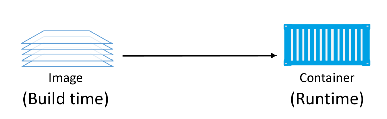
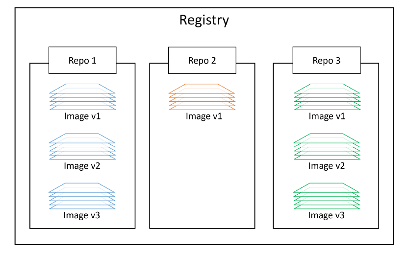
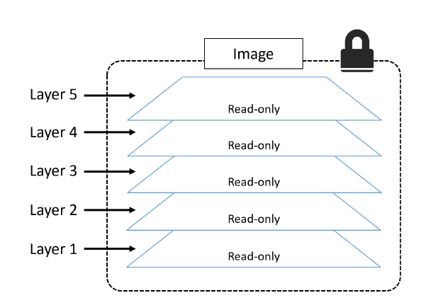
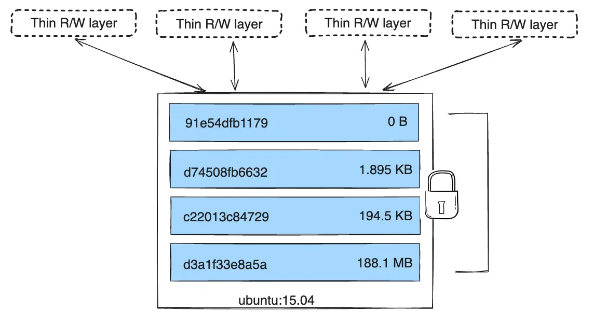

# Docker Images

## About Docker Images
A Docker image is a **unit of packaging that contains everything required for an application to run**. This includes:
- application code
- application dependencies
- OS constructs. 

If you have an application’s Docker image, the only other thing you need to run that application is a computer running Docker.

> You can think of Docker images as similar to VM templates. A VM template is like a stopped VM — a Docker image is like a stopped container.

You get Docker images by **pulling them from an image registry**. The most common registry is Docker Hub, but others exist. The `pull` operation downloads the image to your local Docker host where Docker can use it to start one or more containers.

Images are **made up of multiple layers** that are stacked on top of each other and represented as a single object. Inside of the image is a cut-down operating system (OS) and all of the files and dependencies required to run an application. Because containers are intended to be fast and lightweight, **images tend to be small**.

In fact, you can stop a container and create a new image from it. With this in mind:
- **images** are considered `build-time` constructs,
- **containers** are `run-time` constructs.

<!-- Source: Docker Deep Dive, Nigel Poulton -->

We use the `docker container run` command to start one or more containers from a single image. Once you’ve started a container from an image, the two constructs become dependent on each other and you **cannot delete the image until the last container using it has been stopped** and destroyed. Attempting to delete an image without stopping and destroying all containers using it will result in an error.

### Images are usually small

The whole purpose of a container is to run a **single application or service**. This means it only needs the code and dependencies of the app/service it is running — it does not need anything else. This results in **small images** stripped of all non-essential parts.

For example, Docker images do not ship with 6 different shells for you to choose from. In fact, many application images ship without a shell – if the application doesn’t need **a shell to run it doesn’t need to be included in the image**. General purpose images such as busybox and Ubuntu ship with a shell, but when you package your business applications for production, you will probably package them without a shell.

**Image also don’t contain a kernel — all containers running on a Docker host share access to the host’s kernel**. For these reasons, we sometimes say images contain just enough operating system (usually just OS-related files and filesystem objects).

The official [Alpine Linux Docker image](https://alpinelinux.org/about/) is less than 5MB in size and is an extreme example of how small Docker images can be. Some images are even smaller, however, a more typical example might be something like the official Ubuntu Docker image which is currently about 40MB.

## Pulling images

**A cleanly installed Docker host has no images in its local repository**.

The local image repository on a Linux-based Docker host is usually located at `/var/lib/docker/<storage-driver>`.

You can use the following command to check if your Docker host has any images in its local repository: `sudo docker image ls`

The process of **getting images onto a Docker host is called pulling**. So, if you want the latest Busybox image on your Docker host, you’d have to pull it.
- `sudo docker image pull busybox:latest`
- `sudo docker image pull alpine:latest`
- `sudo docker image pull redis:latest`
- `sudo docker image ls`

As you can see, the images just pulled are now present in the Docker host’s local repository.

## Image registries
We **store images in centralized places called image registries**. This makes it easy to share and access them.

The most common registry is [Docker Hub](https://hub.docker.com). Other registries exist, including 3rd party registries and secure on-premises registries. However, the Docker client is opinionated and defaults to using Docker Hub. 

Docker is configured to use `https://index.docker.io/v2/` as its default registry when pushing and pulling images.

**Image registries** contain one or more **image repositories.** In turn, image repositories contain one or more **images**.

<!-- Source: Docker Deep Dive, Nigel Poulton -->

### Official and unofficial repositories
Docker Hub has the concept of official repositories and unofficial repositories.

As the name suggests, **official repositories** are the home to images that have been vetted and curated by Docker, Inc. This means they should contain up-to-date, high-quality code, that is secure, well-documented, and in-line with best practices.

**Unofficial repositories** can be like the wild-west — you should not assume they are safe, well-documented or built according to best practices. That’s not saying everything in unofficial repositories is bad. There’s some excellent stuff in unofficial repositories. You just need to be **very careful before trusting code from them**. To be honest, you should always be careful when trusting software from the internet — even images from official repositories.

Most of the popular applications and base operating systems have their own official repositories on Docker Hub. They’re easy to spot because they live at the top level of the Docker Hub namespace. The following list contains a few of the official repositories, and shows their URLs that exist at the top-level of the Docker Hub namespace:    
- nginx: https://hub.docker.com/_/nginx/
- busybox: https://hub.docker.com/_/busybox/
- redis: https://hub.docker.com/_/redis/
- mongo: https://hub.docker.com/_/mongo/

## Image naming and tagging

Addressing images from official repositories is as simple as providing the repository name and tag separated by
a colon (:). The format for docker image pull, when working with an image from an official repository is:
- `sudo docker image pull <repository>:<tag>`

Example: `sudo docker image pull alpine:latest`

If you **do not specify an image tag after the repository name**, Docker will assume you are referring to the image tagged as `latest`. If the repository doesn’t have an image tagged as latest the command will fail.

The latest tag doesn’t have any magical powers. Just because an image is tagged as latest does not guarantee it is the most recent image in a repository. For example, the most recent image in the alpine repository is usually tagged as edge. Moral of the story — **take care when using the latest tag.**

Pulling images from an unofficial repository is essentially the same — you just need to prepend the repository name with a Docker Hub username or organization name. 

Example: `sudo docker image pull bitnami/postgresql:14`

If you want to **pull images from 3rd party registries** (not Docker Hub), you need to prepend the repository
name with the DNS name of the registry. For example, the following command pulls the 3.1.5 image from the
google-containers/git-sync repo on the Google Container Registry (gcr.io).
- `sudo docker image pull gcr.io/google-containers/git-sync:v3.1.5`

Notice how the pull experience is exactly the same from Docker Hub and the Google Container Registry.

A **single image can have as many tags as you want**. This is because tags are arbitrary alpha-numeric values that are stored as metadata alongside the image ([example](https://hub.docker.com/_/python)). Once again, the `latest` is an arbitrary tag and is not guaranteed to point to the newest image in a repository.

## Filtering the images on the host

Docker provides the `--filter` flag to filter the list of images returned by docker image ls.
- `sudo docker image ls --filter dangling=true`

A **dangling image is an image that is no longer tagged**, and appears in listings as `<none>:<none>`. A common way they occur is when building a new image giving it a tag that already exists. When this happens, Docker will build the new image, notice that an existing image already has the same tag, remove the tag from the existing image and give it to the new image.

You can **delete all dangling images** on a system with the `sudo docker image prune` command. If you add the `-a` flag, Docker will also remove all unused images (those not in use by any containers).

Docker currently supports the following filters:
- `dangling`: Accepts true or false, and returns only dangling images (true), or non-dangling images (false).
- `before`: Requires an image name or ID as argument, and returns all images created before it.
- `since`: Same as above, but returns images created after the specified image.
- `label`: Filters images based on the presence of a label or label and value. The docker image ls command does not display labels in its output.

## Images and layers

**A Docker image is just a bunch of loosely-connected read-only layers**, with each layer comprising one or more files.

<!-- Source: Docker Deep Dive, Nigel Poulton -->

Docker takes care of stacking these layers and representing them as a single unified object.

There are a few ways to see and inspect the layers that make up an image. In fact, we saw one earlier when pulling images. The following example looks closer at an image pull operation.
- `sudo docker image pull redis:latest`

Each line in the output above that ends with “Pull complete” represents a layer in the image that was pulled. As we can see, this image has 8 layers.

Another way to see the layers of an image is to inspect the image with the docker image inspect command.
- `sudo docker image inspect redis:latest`

The `docker image inspect` command is a great way to see the details of an image.

The `docker history` command is another way of inspecting an image and seeing layer data. However, it **shows the build history of an image** and is not a strict list of layers in the final image. For example, some Dockerfile instructions (“ENV”, “EXPOSE”, “CMD”, and “ENTRYPOINT”) add metadata to the image and do not result in permanent layers being created.
- `sudo docker history redis:latest`

**All Docker images start with a base layer**, and as changes are made and new content is added, new layers are added on top.

> An [example](https://hub.docker.com/layers/library/python/3.9.19-bookworm/images/sha256-c39e7db7ea07b57e384f4a70c08377a1af4404ec5dff514a973d9042714874bd?context=explore) of building a Python image..

The writable container layer exists in the filesystem of the Docker host. It’s typically located on the Docker host in these locations: `/var/lib/docker/<storage-driver>/....`

This thin writable layer is an integral part of a container and enables all read/write operations. If you, or an application, update files or add new files, they’ll be written to this layer. This writable layer of local storage is managed on every Docker host by a storage driver.

Docker uses **storage drivers** to store image layers, and to store data in the writable layer of a container. Examples of storage drivers on Linux include `overlay2`, `fuse-overlayfs`, `btrfs`, `zfs`, and `vfs`.

As their names suggest, each one is based on a Linux filesystem or block-device technology, and each has its own unique performance characteristics. No matter which storage driver is used, the user experience is the same.

> Deeper dive: [About storage drivers](https://docs.docker.com/storage/storagedriver/), [Docker storage drivers](https://docs.docker.com/storage/storagedriver/select-storage-driver/)

The layers are stacked on top of each other. When you create a new container, you add a new writable layer on top of the underlying layers. This layer is often called the **container layer**. All changes made to the running container, such as writing new files, modifying existing files, and deleting files, are written to this thin writable container layer. The diagram below shows a container based on an ubuntu:15.04 image.

<!-- Source: https://docs.docker.com/storage/storagedriver/ -->

The **container's writable layer doesn't persist after the container is deleted**, but is suitable for storing ephemeral data that is generated at runtime. So when the container is deleted, the writable layer is also deleted, but the underlying image remains unchanged. (Stopping a container doesn’t automatically remove it, so a stopped container’s filesystem does still exist.)

> Storage drivers are optimized for space efficiency, but (depending on the storage driver) write speeds are lower than native file system performance, especially for storage drivers that use a copy-on-write filesystem. Write-intensive applications, such as database storage, are impacted by a performance overhead, particularly if pre-existing data exists in the read-only layer. Use Docker volumes for write-intensive data.

The major difference between a container and an image is the top writable layer. Because each container has its own writable container layer, and all changes are stored in this container layer, multiple containers can share access to the same underlying image and yet have their own data state. The diagram below shows multiple containers sharing the same Ubuntu 15.04 image.

<!-- Source: https://docs.docker.com/storage/storagedriver/ -->

A container **can edit existing files from the image layers.** But image layers are read-only, so Docker does some special magic to make that happen. It uses a **copy-on-write process** to allow edits to files that come from read-only layers. When the container tries to edit a file in an image layer, Docker actually makes a copy of that file into the writable layer, and the edits happen there. It’s all seamless for the container and the application, but it’s the cornerstone of Docker’s super-efficient use of storage.

> Advanced explanation: [Understanding the copy-on-write mechanism](./The_copy_on_write_CoW_strategy.md)

### Sharing image layers

Multiple images can, and do, share layers. This leads to efficiencies in space and performance.

Let’s take a second look at the docker image pull command:
- `sudo docker image prune -a`
- `sudo docker image pull python:3.12.3-slim-bookworm`
- `sudo docker image pull python:3.11.9-slim-bookworm`

Notice the lines ending in `Already exists`. These lines tell us that Docker is smart enough to recognize when it’s being asked to pull an image layer that it already has a local copy of.

## Deleting Images

When you no longer need an image on your Docker host, you can delete it with the `docker image rm` command. `rm` is short for remove.

Deleting an image will remove the image and all of its layers from your Docker host. This means it will no longer show up in `docker image ls` commands and all directories on the Docker host containing the layer data will be deleted. However, **if an image layer is shared by more than one image, that layer will not be deleted until all images that reference it have been deleted**.

Delete the images pulled in the previous steps with the docker image rm command. The following example deletes an image by its ID, this might be different on your system.
- `sudo docker image ls`
- `sudo docker image rm python:3.12.3-slim-bookworm`
- `sudo docker image rm python:3.11.9-slim-bookworm`

If the image you are trying to delete is in use by a running container you will not be able to delete it. Stop and delete any containers before trying the delete operation again.

A handy **shortcut for deleting all images** on a Docker host is to run the `sudo docker image prune -a` command. This command will remove all images that are not in use by a container.
