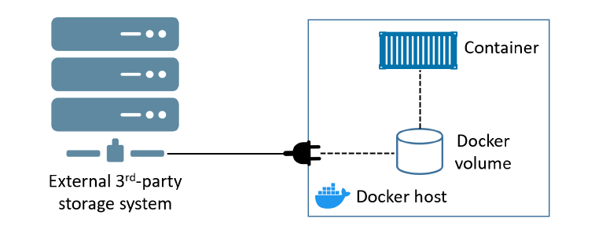

#  Docker Storage And Volumes

## Introduction to Docker Storage And Volumes

Consider what it might look like to run a database program inside a container.
You would package the software with the image, and when you start the container,
it might initialize an empty database. 
- When programs connect to the database and enter data, where is that data stored? 
- Is it in a file inside the container? 
- What happens to that data when you stop the container or remove it? 
- How would you move your data if you wanted to upgrade the database program? 
- What happens to that storage on a cloud machine when it is terminated?

Consider another situation where you’re running a couple of different web applications
inside different containers. 
- Where would you write log files so that they will outlive the container? 
- How would you get access to those logs to troubleshoot a problem?
- How can other programs such as log digest tools get access to those files?

---

Containers are designed to be immutable. It’s a best practice not to change the configuration of a container after it’s deployed. **You shouldn’t log into a running container and make configuration changes.**

Many applications require a read-write filesystem in order to simply run – they won’t even run on a read-only filesystem. This means it’s not as simple as making containers entirely read-only.

Containers are a **perfect runtime for stateless applications**. You can meet increased demand by running multiple containers on your cluster, knowing that every container will handle requests in the same way. You can release updates with an automated rolling upgrade, which keeps your app online the whole time.

But not all parts of your app will be stateless. There will be components that use disks to improve performance or for permanent data storage. And you can run those components in Docker containers too. **Stateful applications that persist data are becoming more and more important in the world of cloud-native** and microservices applications.

There are two main categories of data — persistent and non-persistent.
- **Persistent** is the data you need to keep. 
    - Things like; customer records, financial data, research results, audit logs, and even some types of application log data. 
    - To deal with persistent data, a container needs to store it in a volume.
- **Non-persistent** is the data you don’t need to keep.
    - To deal with non-persistent data, every Docker container gets its own non-persistent storage. This is automatically created for every container and is tightly coupled to the lifecycle of the container. As a result, deleting the container will delete the storage and any data on it.

There’s a popular opinion that containers aren’t good for stateful applications that persist data. This was true a few years ago. However, things are changing, and technologies now exist that **make containers a viable choice for many stateful applications**.


## Containers and non-persistent data

By default all files created inside a container are stored on a writable container layer. This means that:
- The data **doesn't persist when that container no longer exists**, and it can be difficult to get the data out of the container if another process needs it.
- A container's **writable layer is tightly coupled to the host machine** where the container is running. You can't easily move the data somewhere else.
- Writing into a container's writable layer requires a storage driver to manage the filesystem. The **storage driver provides a union filesystem, using the Linux kernel. This extra abstraction reduces performance** as compared to using data volumes, which write directly to the host filesystem.

Docker has two options for containers to store files on the host machine, so that the files are persisted even after the container stops: **volumes**, and **bind mounts**.

Docker also supports containers storing files in-memory on the host machine. Such files are not persisted. If you're running Docker on Linux, **tmpfs mount** is used to store files in the host's system memory. If you're running Docker on Windows, named pipe is used to store files in the host's system memory.

**No matter which type of mount you choose to use, the data looks the same from within the container**. It is exposed as either a directory or an individual file in the container's filesystem.


<!-- Source: https://docs.docker.com/storage/ -->

## Running containers with Docker volumes
A Docker volume is a unit of storage—you can think of it as a USB stick for containers. Volumes are the recommended way to persist data in containers. There are three major reasons for this:
- Volumes are **independent objects** that are not tied to the lifecycle of a container
- Volumes can be mapped to **specialized external storage** systems
- Volumes enable **multiple containers** on different Docker hosts to access and **share the same data**

At a high-level, you create a volume, then you create a container and mount the volume into it. The volume is mounted into a directory in the container’s filesystem, and anything written to that directory is stored in the volume. **If you delete the container, the volume and its data will still exist.**


<!-- Source: Docker Deep Dive, Nigel Poulton -->

The `/code` directory is a Docker volume that can either be mapped to an external storage system or a directory on the Docker host. Either way, its lifecycle is decoupled from the container. All other directories in the container use the thin writable container layer in the local storage area on the Docker host.

## Creating and managing Docker volumes

Volumes are **first-class citizens** in Docker. Among other things, this means they are their own object in the API and have their own `docker volume` sub-command. 

There are two ways to use volumes with containers: 
- you can manually create volumes and attach them to a container
- you can use a VOLUME instruction in the Dockerfile

Use the following command to **create a new volume** called myvol.
- `sudo docker volume create myvol`

By default, Docker creates new volumes with the **built-in local driver**. As the name suggests, volumes created with the local driver are only available to containers on the same node as the volume. You can use the `-d` flag to specify a different driver.

Third-party volume drivers are available as plugins. These provide Docker with seamless access external storage systems such as cloud storage services and on-premises storage systems including SAN or NAS.

> [More](https://docs.docker.com/storage/volumes/#use-a-volume-driver) about third party volme drivers.


<!-- Source: Docker Deep Dive, Nigel Poulton -->

Now that the volume is created, you can see it with the `docker volume ls` command and inspect it with the `docker volume inspect` command.
- `sudo docker volume ls`
- `sudo docker volume inspect myvol`

Notice that the `Driver` and `Scope` are both local. This means the volume was created with the local driver and is only available to containers on this Docker host. 

The `Mountpoint` property tells us where in the Docker host’s filesystem the volume exists. All volumes created with the local driver get their own directory under `/var/lib/docker/volumes` on Linux. This means you can see them in your Docker host’s filesystem. You can even **access them directly from your Docker host, although this is not normally recommended**.

There are two ways to delete a Docker volume:
- `sudo docker volume prune` will delete all volumes that are not mounted into a container or service replica.
- `sudo docker volume rm` lets you specify exactly which volumes you want to delete. 

Neither command will delete a volume that is in use by a container or service replica.

## Demonstrating volumes with containers and services

**If you start a container with a volume that does not yet exist, Docker creates the volume for you**. 

There are 2 options to use volumes with containers. In general, `--mount` is more explicit and verbose. The biggest difference is that the `-v` syntax combines all the options together in one field, while the `--mount` syntax separates them. If you need to specify volume driver options, you must use `--mount`.

> [Choose the -v or --mount flag](https://docs.docker.com/storage/volumes/#choose-the--v-or---mount-flag). As opposed to bind mounts, all options for volumes are available for both `--mount` and `-v` flags.

Use the following command to create a new standalone container that mounts a volume:
- `sudo docker run -d --name dev-server --mount source=server-data,target=/app nginx:latest`

or

- `sudo docker run -d --name dev-server -v server-data:/app nginx:latest`

Use docker inspect command to verify that the volume was created: `sudo docker volume inspect server-data` and mounted correctly: `sudo docker inspect dev-server` (Mounts section)

Although containers and volumes have separate lifecycle’s, you cannot delete a volume that is in use by a container: `sudo docker volume rm server-data`

The volume is brand new, so it doesn’t have any data. Let’s exec onto the container and write some data to it.
- `sudo docker container exec -it dev-server sh`
- `ls -lah`
- `echo "Test volume" > /app/file1`
- `ls -l /app`
- `cat /app/file1`

Type `exit` to return to the shell of your Docker host, and then delete the container with the following command: `sudo docker container rm -f dev-server`

Even though the container is deleted, the volume still exists: `sudo docker container ls -a` and `sudo docker volume ls`.

Because the volume still exists, you can look at its mount point on the host to check if the data is still there. Run the following commands from the terminal of your Docker host. The first one will show that the file still exists, the second will show the contents of the file.
- `sudo ls -l /var/lib/docker/volumes/server-data/_data/`
- `sudo cat /var/lib/docker/volumes/server-data/_data/file1`

It’s even possible to mount the volume into a new service or container.
- `sudo docker run -d --name dev-server-2 --mount source=server-data,target=/app nginx:latest`

Exec onto the container and check that the data is present:
- `sudo docker container exec -it dev-server-2 sh`
- `cat /app/file1`
- `exit`

Excellent, the volume has preserved the original data and made it available to a new container.

Stop the container and remove the volume. Note volume removal is a separate step.
- `sudo docker container stop dev-server-2`
- `sudo docker container rm dev-server-2`
- `sudo docker volume rm server-data`

## Populate a volume using a container
If you start a container which creates a new volume and the container has files or directories in the directory to be mounted, the **directory’s contents are copied into the volume**. The container then mounts and uses the volume, and other containers which use the volume also have access to the pre-populated content.

To illustrate this, this example starts an nginx container and populates the new volume `nginx-vol` with the contents of the container’s `/usr/share/nginx/html` directory, which is where Nginx stores its default HTML content.
- `sudo docker run -d --name=nginxtest -v nginx-vol:/usr/share/nginx/html nginx:latest`
- `sudo docker exec -it nginxtest /bin/bash`
- `ls /usr/share/nginx/html`
- `exit`
- `sudo docker container rm -f nginxtest`
- `sudo docker volume rm nginx-vol`

> If you mount a bind mount or non-empty volume into a directory in the container in which some files or directories exist, these files or **directories are obscured by the mount**, just as if you saved files into /mnt on a Linux host and then mounted a USB drive into /mnt. The contents of /mnt would be obscured by the contents of the USB drive until the USB drive was unmounted. The obscured files are not removed or altered, but are not accessible while the bind mount or volume is mounted.

## Use a read-only volume
For some development applications, the container needs to write into the bind mount so that changes are propagated back to the Docker host. At other times, the **container only needs read access to the data**. Remember that multiple containers can mount the same volume, and it can be mounted read-write for some of them and read-only for others, at the same time.

This example modifies the one above but **mounts the directory as a read-only volume**, by adding `ro` to the (empty by default) list of options, after the mount point within the container. 
- `sudo docker run -d --name=nginxtest -v nginx-vol:/usr/share/nginx/html:ro nginx:latest`
- `sudo docker inspect nginxtest`
- `sudo docker exec -it nginxtest /bin/bash`
- `cd /usr/share/nginx/html`
- `touch test` -> touch: cannot touch 'test': Read-only file system
- `exit`
- `sudo docker container rm -f nginxtest`
- `sudo docker volume rm nginx-vol`

## Share data between Docker containers

A **major concern** with any configuration that shares a **single volume among multiple containers is data corruption**.

The application running in `ctr-1` updates some data in the shared volume. However, instead of writing the update directly to the volume, it holds it in its local buffer for faster recall (this is common in many operating systems). At this point, the application in `ctr-1` thinks the data has been written to the volume. However, before `ctr-1` flushes its buffers and commits the data to the volume, the app in `ctr-2` updates the same data with a different value and commits it directly to the volume. At this point, both applications think they’ve updated the data in the volume, but in reality only the application in `ctr-2` has. A few seconds later, `ctr-1` flushes the data to the volume, overwriting the changes made by the application in `ctr-2`. However, the application in `ctr-2` is totally unaware of this! 

To prevent this, you need to write your applications in a way to avoid things like this.

Example of sharing a volume:
- `sudo docker run -d --name=nginxtest -p 80:80 -v nginx-vol:/usr/share/nginx/html:ro nginx:latest`
- Open the browser and navigate to `http://<IP>`
- `sudo docker run -d --name=downloader -v nginx-vol:/web-data busybox:latest sleep 5000`
- `sudo docker exec -it downloader /bin/sh`
- `cd web-data`
- `wget http://example.com/ -O index.html`
- Refresh and check the browser again
- `wget http://www.iana.org/domains/reserved -O index.html`
- `exit`
- `sudo docker rm -f nginxtest downloader`
- `sudo docker volume rm nginx-vol`

## Use a third party volume driver (Advanced)
More [here](./Use_a_third_party_volume_driver_Advanced.md).

## Running containers with filesystem mounts (Bind mounts)

Docker also provides a **more direct way of sharing storage** between containers and hosts using **bind mounts**.

A bind mount **makes a directory on the host available as a path on a container**. The bind mount is transparent to the container—it’s just a directory that is part of the container’s filesystem. But it means you can access host files from a container and vice versa, which unlocks some interesting patterns.

> Documentation: [Use bind mounts](https://docs.docker.com/storage/bind-mounts/).

**Bind mounts let you explicitly use the filesystem on your host machine** for container data. That could be:
- a fast solid-state disk, 
- a highly available array of disks, 
- or even a distributed storage system that’s accessible across your network. 

If you can access that filesystem on your host, you can use it for containers.

We are **running a web server** that depends on **sensitive configuration** on the host and emits **access logs** that need to be forwarded by your log-shipping system. You could use Docker to launch the web server in a container and bind-mount the configuration location as well as the location where you want the web server to write logs.
- `cd Part_04_Docker_Storage_And_Volumes`
- `cat examples/01_nginx/example.conf`

Once a server is started with this configuration file, it will offer the NGINX default site, and access logs for that site will be written to a file in the container at `/var/log/nginx/custom.host.access.log`. The following command will start an NGINX HTTP server in a container where your new configuration is bind-mounted to the server’s configuration root:
- `CONF_SRC=$(pwd)/examples/01_nginx/example.conf`
- `LOGS_SRC=$(pwd)/examples/01_nginx/example.log`
- `touch $LOGS_SRC`

In general, `--mount` is more explicit and verbose. New users should use the `--mount` syntax.
- The **type** of the mount, which can be `bind`, `volume`, or `tmpfs`.
- The **source** of the mount. For bind mounts, this is the path to the file or directory on the Docker daemon host. May be specified as `source` or `src`.
- The **destination** takes as its value the path where the file or directory is mounted in the container. May be specified as `destination`, `dst`, or `target`.
```bash
sudo docker run -d --name my-server \
        --mount type=bind,source=${CONF_SRC},target=/etc/nginx/conf.d/default.conf \
        --mount type=bind,source=${LOGS_SRC},target=/var/log/nginx/custom.host.access.log \
        -p 80:80 \
        nginx:latest
```

Try to access the server in your browser by navigating to `http://<IP>`. You should see the default NGINX welcome page. You can also check the logs by running `sudo cat $LOGS_SRC`.

The bind mount is **bidirectional**. You can create files in the container and edit them on the host, or create files on the host and edit them in the container.
- `sudo docker rm -f my-server`

Expanding on this use case, suppose you want to make sure that the NGINX web
server **can’t change the contents of the configuration volume**. Even the most trusted software can contain vulnerabilities, and it’s best to minimize the impact of an attack on your website. If you don’t need to write files, you can bind mount the host directory as **read-only inside the container**. This is one option for surfacing configuration settings from the host into the application container.

```bash
sudo docker run -d --name my-server \
        --mount type=bind,source=${CONF_SRC},target=/etc/nginx/conf.d/default.conf,readonly \
        --mount type=bind,source=${LOGS_SRC},target=/var/log/nginx/custom.host.access.log \
        -p 80:80 \
        nginx:latest
```
You can bind-mount any source that your host computer has access to.
- `sudo docker rm -f my-server`

> **Bind mounts allow access to sensitive files** One side effect of using bind mounts, for better or for worse, is that you can change the host filesystem via processes running in a container, including creating, modifying, or deleting important system files or directories. This is a powerful ability which can have security implications, including impacting non-Docker processes on the host system.

Bind mounts have limited functionality compared to volumes. When you use a bind mount, a file or directory on the host machine is mounted into a container. The file or directory is referenced by its absolute path on the host machine. If a container description depends on content at a specific location on the host filesystem, that description **isn’t portable to hosts where the content is unavailable or available in some other location**.

## Limitations of filesystem mounts

**What happens when you run a container with a mount, and the mount target directory already exists and has files from the image layers?**
- When you mount a target that already has data, the source directory replaces the target directory  — so the **original files from the image are not available.**
- `sudo docker run -d --name no-mount nginx:latest`
- `sudo docker exec no-mount ls -la /usr/share/nginx/html`
- `CONF_SRC=$(pwd)/examples/02_mount_folder`
- `sudo docker run -d --name mount --mount type=bind,source=${CONF_SRC},target=/usr/share/nginx/html nginx:latest`
- `sudo docker exec mount ls -la /usr/share/nginx/html`
- `sudo docker rm -f mount no-mount`

**What happens if you mount a single file from the host to a target directory that exists in the container filesystem?**
- This time the directory contents are merged, so you’ll see the original files from the image and the new file from the host.
- `CONF_SRC=$(pwd)/examples/02_mount_folder/test.html`
- `sudo docker run -d --name mount --mount type=bind,source=${CONF_SRC},target=/usr/share/nginx/html/test.html nginx:latest`
- `sudo docker exec mount ls -la /usr/share/nginx/html`
- `sudo docker rm -f mount`

## Understanding how the container filesystem is built (Advanced)
More [here](./Understanding_how_the_container_filesystem_is_built_Advanced.md).

## Use tmpfs mounts (Advanced)
More [here](./Use_tmpfs_mounts_Advanced.md).

## Choose the right type of mount
No matter which type of mount you choose to use, the data looks the same from within the container. It is exposed as either a directory or an individual file in the container’s filesystem.

An easy way to visualize the difference among volumes, bind mounts, and tmpfs mounts is to think about where the data lives on the Docker host.


<!-- Source: https://docs.docker.com/storage/ -->

- **Volumes** are stored in a part of the host filesystem which is managed by Docker (`/var/lib/docker/volumes/` on Linux). Non-Docker processes should not modify this part of the filesystem. Volumes are the best way to persist data in Docker.
- **Bind mounts** may be stored anywhere on the host system. They may even be important system files or directories. Non-Docker processes on the Docker host or a Docker container can modify them at any time.
- **tmpfs mounts** are stored in the host system’s memory only, and are never written to the host system’s filesystem.

### Good use cases for volumes
Volumes are the preferred way to persist data in Docker containers and services. Some use cases for volumes include:
- **Sharing data among multiple running containers**.
- When the Docker **host is not guaranteed to have a given directory** or file structure. Volumes help you decouple the configuration of the Docker host from the container runtime.
- When you want to **store your container’s data on a remote host or a cloud provider**, rather than locally.
- When you need to **back up, restore, or migrate data from one Docker host to another**, volumes are a better choice.
- When your application requires high-performance I/O on Docker Desktop. Volumes are stored in the Linux VM rather than the host, which means that the reads and writes have much lower latency and higher throughput.
- When your application requires fully native file system behavior on Docker Desktop. 

### Good use cases for bind mounts
In general, you should use volumes where possible. Bind mounts are appropriate for the following types of use case:
- **Sharing configuration files** from the host machine to containers. This is how Docker provides DNS resolution to containers by default, by mounting `/etc/resolv.conf` from the host machine into each container.
- **Sharing source code** or build artifacts between a **development environment** on the Docker host and a container.
- When the file or directory structure of the Docker host is guaranteed to be consistent with the bind mounts the containers require.

### Good use cases for tmpfs mounts
- tmpfs mounts are best used for cases **when you do not want the data to persist either on the host machine or within the container**. This may be for security reasons or to protect the performance of the container when your application needs to write a large volume of non-persistent state data.


## Example: Run a PostgreSQL database

Run the [postgres](https://hub.docker.com/_/postgres/) container. PostgreSQL, often simply "Postgres", is an object-relational database management system (ORDBMS) with an emphasis on extensibility and standards-compliance. As a database server, its primary function is to store data, securely and supporting best practices, and retrieve it later, as requested by other software applications, be it those on the same computer or those running on another computer across a network (including the Internet). It can handle workloads ranging from small single-machine applications to large Internet-facing applications with many concurrent users. Recent versions also provide replication of the database itself for security and scalability.

- `cd Part_04_Docker_Storage_And_Volumes`
- `CONF_PATH=$(pwd)/examples/03_postgres/my-postgres.conf`
- `sudo docker volume create pgdata`
```bash
sudo docker run -d --name my-database \
        --mount type=bind,source=${CONF_PATH},target=/etc/postgresql/postgresql.conf,readonly \
        -v pgdata:/var/lib/postgresql/data \
        -e POSTGRES_USER=test \
        -e POSTGRES_PASSWORD=<password> \
        -e POSTGRES_DB=test \
        postgres -c 'config_file=/etc/postgresql/postgresql.conf'
```
- `sudo docker exec -it my-database psql -U test`
- `\l`
- `\c test`
- `CREATE TABLE MYDATA(ID INT);`
- `\dt`
- `exit`
- `sudo docker rm -f my-database`
- `sudo docker volume rm pgdata`
