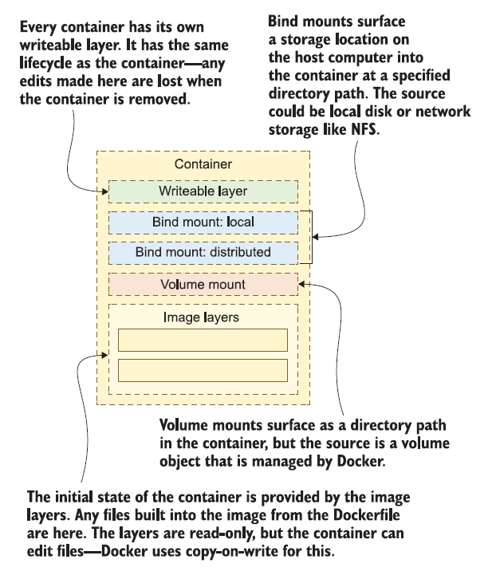

# Understanding how the container filesystem is built (Advanced)

Every container has a single disk, which is a virtual disk that Docker pieces
together from several sources. Docker calls this the **union filesystem**.

The union filesystem lets the container see a single disk drive and work with files and directories in the same way, wherever they may be on the disk. But the locations on the disk can be physically stored in different storage units,

<!-- Vir: Elton Stoneman: Learn Docker in a month of Lounches -->

Applications inside a container see a single disk, but as the image author or container user, you choose the sources for that disk. There can be multiple image layers, multiple volume mounts, and multiple bind mounts in a container, but they will always have a single writeable layer. Here are some general guidelines for how you should use the storage options:
- **Writeable layer** — Perfect for short-term storage, like caching data to disk to save on network calls or computations. These are unique to each container but are gone forever when the container is removed.
- **Local bind mounts** — Used to share data between the host and the container. Developers can use bind mounts to load the source code on their computer into the container, so when they make local edits to HTML or JavaScript files, the changes are immediately in the container without having to build a new image.
- **Distributed bind mounts** — Used to share data between network storage and containers. These are useful, but you need to be aware that network storage will not have the same performance as local disk and may not offer full filesystem features. They can be used as read-only sources for configuration data or a shared cache, or as read-write to store data that can be used by any container on any machine on the same network.
- **Volume mounts** — Used to share data between the container and a storage object that is managed by Docker. These are useful for persistent storage, where the application writes data to the volume. When you upgrade your app with a new container, it will retain the data written to the volume by the previous version.
- **Image layers** — These present the initial filesystem for the container. Layers are stacked, with the latest layer overriding earlier layers, so a file written in a layer at the beginning of the Dockerfile can be overridden by a subsequent layer that writes to the same path. Layers are read-only, and they can be shared between containers.
