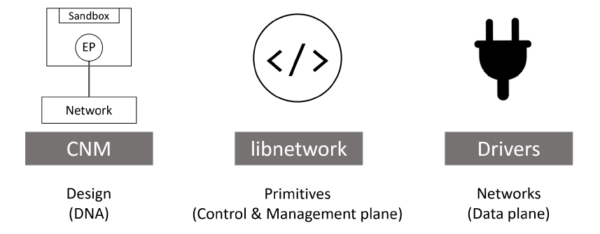
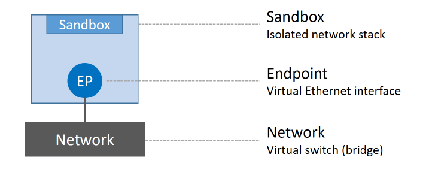
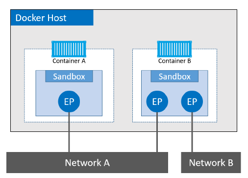
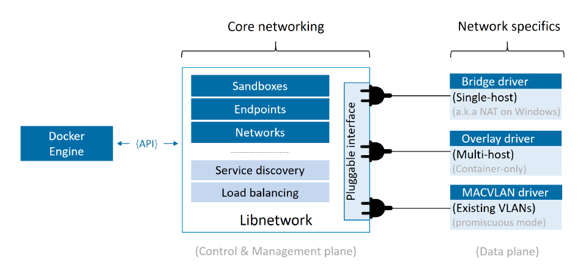

# Docker network architecture (Advanced)

At the highest level, Docker networking comprises three major components:
- **The Container Network Model (CNM)**: The CNM is the design specification. It outlines the fundamental building blocks of a Docker network.
- **libnetwork**: libnetwork is a real-world implementation of the CNM, and is used by Docker. It’s written in Go, and implements the core components outlined in the CNM.
- **Drivers**: Drivers extend the model by implementing specific network topologies such as VXLAN overlay networks.

<!-- Source: Docker Deep Dive, Nigel Poulton -->

## The Container Network Model (CNM)

Everything starts with a design. The design guide for Docker networking is the CNM. It outlines the fundamental building blocks of a Docker network, and you can read the full spec [here](https://github.com/docker/libnetwork/blob/master/docs/design.md). At a high level, it defines three major building blocks:
- **Sandboxes**: A sandbox is an isolated network stack. It includes; Ethernet interfaces, ports, routing tables, and DNS config.
- **Endpoints**: Endpoints are virtual network interfaces (E.g. veth). Like normal network interfaces, they’re responsible for making connections. In the case of the CNM, it’s the job of the endpoint to connect a sandbox to a network.
- **Networks**: Networks are a software implementation of an switch (802.1d bridge). As such, they group together and isolate a collection of endpoints that need to communicate.

<!-- Source: Docker Deep Dive, Nigel Poulton -->

The atomic unit of scheduling in a Docker environment is the container, and as the name suggests, the Container Network Model is all about providing networking to containers. Sandboxes are placed inside of containers to provide network connectivity.

<!-- Source: Docker Deep Dive, Nigel Poulton -->

Container A has a single interface (endpoint) and is connected to Network A. Container B has two interfaces (endpoints) and is connected to Network A and Network B.

The two containers will be able to communicate because they are both connected to Network A. However, the two endpoints in Container B cannot communicate with each other without the assistance of a layer 3 router.

It’s also important to understand that **endpoints behave like regular network adapters**, meaning they can only be connected to a single network. Therefore, if a container needs connecting to multiple networks, it will need multiple endpoints.

Although Container A and Container B are running on the same host, their network stacks are completely isolated at the OS-level via the sandboxes.

## Libnetwork
The CNM is the design doc, and libnetwork is the canonical implementation. It’s open-source, written in Go, cross-platform (Linux and Windows), and used by Docker.

In the early days of Docker, all the networking code existed inside the daemon. This was a nightmare — the daemon became bloated, and it didn’t follow the Unix principle of building modular tools that can work on their own, but also be easily composed into other projects. As a result, it all got ripped out and refactored into an external library called libnetwork based on the principles of the CNM. Nowadays, all of the core Docker networking code lives in libnetwork.

As you’d expect, it implements all three of the components defined in the CNM. It also implements native service discovery, ingress-based container load balancing, and the network control plane and management plane functionality.

## Drivers

If libnetwork implements the control plane and management plane functions, then drivers implement the data plane. For example, **connectivity and isolation is all handled by drivers**. So is the actual creation of networks.

<!-- Source: Docker Deep Dive, Nigel Poulton -->

Docker ships with several built-in drivers, known as native drivers or local drivers. On Linux they include; bridge, overlay, and macvlan.

3rd-parties can also write Docker network drivers known as remote drivers or plugins. Weave Net is a popular example and can be downloaded from Docker Hub.

Each driver is in charge of the actual creation and management of all resources on the networks it is responsible for. For example, an overlay network called “prod-fe-cuda” will be owned and managed by the overlay driver.This means the overlay driver will be invoked for the creation, management, and deletion of all resources on that network.

In order to meet the demands of complex highly-fluid environments, libnetwork allows multiple network drivers to be active at the same time. This means your Docker environment can sport a wide range of heterogeneous networks.
