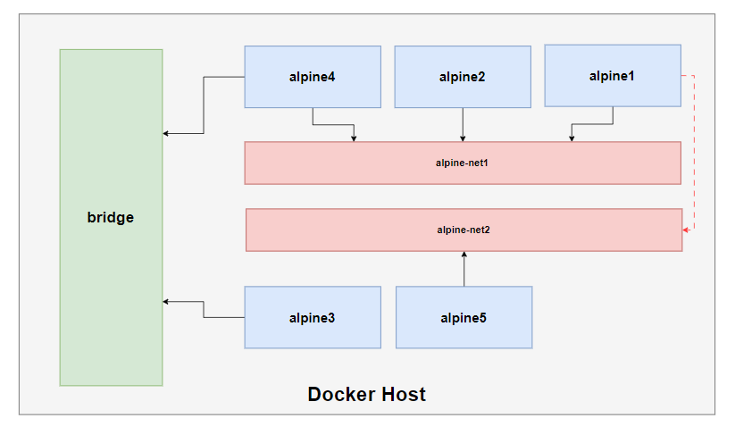

# Docker Networking

## Docker networking overview
Docker runs applications inside of containers, and applications need to communicate over lots of different networks. This means Docker needs strong networking capabilities.

One of the reasons Docker containers and services are so powerful is that you can **connect them together**, or **connect them to non-Docker workloads** and VLANs.

Docker **abstracts the underlying host-attached network from containers**. Doing so provides a degree of runtime environment agnosticism for the application, and allows infrastructure managers to adapt the implementation to suit the operating environment.

Docker also treats **networks as first-class entities**. This means that they have their own life cycle and are not bound to any other objects. You can define and manage them directly by using the `docker network` subcommands.

To get started with networks in Docker, examine the **default networks** that are available with every Docker installation. Running `docker network ls` will print a table of all the networks to the terminal.
- `sudo docker network ls`

By default, Docker includes three networks, and each is provided by a different driver.
- The network named **bridge** is the default network and provided by a bridge driver. The bridge driver provides intercontainer connectivity for all containers running on the same machine. 
- The **host** network is provided by the host driver, which instructs Docker not to create any special networking namespace or resources for attached containers. Containers on the host network interact with the host’s network stack like uncontained processes. 
- Finally, the **none** network uses the null driver. Containers attached to the none network will not have any network connectivity outside themselves.

## Docker network architecture (Advanced)

More [here](./Docker_network_architecture_Advanced.md).

## Network drivers
Docker’s networking subsystem is pluggable, using drivers. Several drivers exist by default, and provide core networking functionality:
- **`bridge`**: The default network driver. If you don’t specify a driver, this is the type of network you are creating. Bridge networks are usually used when your applications run in standalone containers that need to communicate.
    - The default bridge network maintains compatibility with legacy Docker and cannot take advantage of modern Docker features including service discovery or load balancing. Using it is not recommended. So the first thing you should do is create your own bridge network.
    - User-defined bridge networks are best when you need multiple containers to communicate on the same Docker host.
- **`host`**: For standalone containers, remove network isolation between the container and the Docker host, and use the host’s networking directly.
    - Host networks are best when the network stack should not be isolated from the Docker host, but you want other aspects of the container to be isolated.
- **`overlay`**: Overlay networks connect multiple Docker daemons together and enable swarm services to communicate with each other.
    - Overlay networks are best when you need containers running on different Docker hosts to communicate, or when multiple applications work together using swarm services.
- **`ipvlan`**: IPvlan networks give users total control over both IPv4 and IPv6 addressing. The VLAN driver builds on top of that in giving operators complete control of layer 2 VLAN tagging and even IPvlan L3 routing for users interested in underlay network integration.
- **`macvlan`**: Macvlan networks allow you to assign a MAC address to a container, making it appear as a physical device on your network. 
    - The Docker daemon routes traffic to containers by their MAC addresses. 
    - Using the macvlan driver is sometimes the best choice when dealing with legacy applications that expect to be directly connected to the physical network, rather than routed through the Docker host’s network stack.
    - Macvlan networks are best when you are migrating from a VM setup or need your containers to look like physical hosts on your network, each with a unique MAC address.
- **`none`**: For this container, disable all networking. Usually used in conjunction with a custom network driver.
- **`Network plugins`**: You can install and use third-party network plugins with Docker. These plugins are available from Docker Hub or from third-party vendors. See the vendor’s documentation for installing and using a given network plugin.

## Bridge networks

In terms of networking, a bridge network is a Link Layer device which forwards traffic between network segments. A bridge can be a hardware device or a software device running within a host machine’s kernel.

In terms of Docker, a **bridge network uses a software bridge which allows containers connected to the same bridge network to communicate**, while providing isolation from containers which are not connected to that bridge network. 

The Docker bridge driver automatically **installs rules in the host machine** so that containers on different bridge networks cannot communicate directly with each other.
- `sudo iptables -L`

Bridge networks apply to containers **running on the same Docker daemon host**. Every Docker host gets a default single-host bridge network.

Docker networks built with the bridge driver on Linux hosts are based on the battle-hardened linux bridge technology that has existed in the Linux kernel for nearly 20 years. This means they’re high performance and extremely stable. It also means you can inspect them using standard Linux utilities.
- `ip addr show docker0`

The default “bridge” network, on all Linux-based Docker hosts, maps to an underlying Linux bridge in the kernel called “docker0”. We can see this from the output of docker network inspect.
- `sudo docker network inspect bridge | grep bridge.name`

A container attached to a Docker network will get a unique IP address that is routable from other containers attached to the same Docker network.

> Documentation: [Use bridge networks](https://docs.docker.com/network/bridge/)

### Use the default bridge network
In this example, you start two different alpine containers on the same Docker host and do some tests to understand how they communicate with each other.

List current networks before you do anything else. Here’s what you should see if you’ve never added a network or initialized a swarm on this Docker daemon. You may see different networks, but you should at least see these (the network IDs will be different):
- `sudo docker network ls`

Start two alpine containers running `ash`, which is Alpine’s default shell rather than bash. Since you are starting it detached, you won’t be connected to the container right away. Instead, the container’s ID will be printed. Because you have not specified any `--network` flags, the **containers connect to the default bridge network**.
- `sudo docker run -dit --name alpine1 alpine ash`
- `sudo docker run -dit --name alpine2 alpine ash`
- `sudo docker container ls`
- `sudo docker network inspect bridge` (Inspect the bridge network to see what containers are connected to it.)
- `ip addr show` (see new veth interface in the host)
- `bridge link`
- `sudo docker attach alpine1`
- `ip addr show` (show the network interfaces for alpine1 as they look from within the container)
- `ping -c 2 google.com` (make sure you can connect to the internet)
- `ping -c 2 <alpine2 IP>` (ping the second container)
- `ping -c 2 alpine2` (Try pinging the alpine2 container by container name. This will fail.)
- Detach from alpine1 without stopping it by using the detach sequence, `CTRL + p CTRL + q`
- `sudo docker attach alpine2`
- `ip addr show`
- `ping -c 2 google.com`
- `ping -c 2 <alpine1 IP>` (ping the first container)
- `ping -c 2 alpine1`
- Detach from alpine2 without stopping it by using the detach sequence, `CTRL + p CTRL + q`
- `sudo docker container rm -f alpine1 alpine2`

Remember, **the default bridge network is not recommended for production**.

### Use user-defined bridge networks
Create the alpine-net1 network. You do not need the `--driver bridge` flag since it’s the default, but this example shows how to specify it.
- `sudo docker network create --driver bridge alpine-net1`
- `sudo docker network ls`
- `sudo docker network inspect alpine-net1` (This shows you its IP address and the fact that no containers are connected to it. Notice the different network’s gateway.)

You can specify the subnet, the IP address range, the gateway, and other options. See the [docker network create reference](https://docs.docker.com/engine/reference/commandline/network_create/#specify-advanced-options) or the output of docker network create --help for details.
```bash
sudo docker network create \
        --driver bridge \
        --attachable \
        --gateway 10.0.42.1 \
        --subnet 10.0.42.0/24 \
        --ip-range 10.0.42.128/25 \
        alpine-net2
```
- `sudo docker network ls`
- `sudo docker network inspect alpine-net2`

Marking the new network as attachable allows you to attach and detach containers to the network at any time.



Create the containers. Notice the `--network` flags. 
- `sudo docker run -dit --name alpine1 --network alpine-net1 alpine ash`
- `sudo docker run -dit --name alpine2 --network alpine-net1 alpine ash`
- `sudo docker run -dit --name alpine3 alpine ash`
- `sudo docker run -dit --name alpine4 --network alpine-net1 alpine ash`
- `sudo docker network connect bridge alpine4` (You can **only connect to one network during the docker run command**, so you need to use `docker network connect` afterward to connect alpine4 to the bridge network as well.)
- `sudo docker run -dit --name alpine5 --network alpine-net2 alpine ash`
- `sudo docker container ls`
- `sudo docker network inspect alpine-net1`
- `sudo docker network inspect alpine-net2`
- `sudo docker network inspect bridge`
- `sudo docker container attach alpine1`
- `ip addr show`

You can see from this list that the container has two network devices with IPv4
addresses. Those are the loopback interface (or localhost) and eth0 (a virtual Ethernet device), which is connected to the bridge network. The loopback interface can be used only for communication within the same container.
- `ping -c 2 <alpine2 IP>`
- `ping -c 2 alpine2`
- `ping -c 2 alpine4`
- `ping -c 2 alpine3` (You should not be able to connect to alpine3 at all, since it is not on the alpine-net1 network.)
- `ping -c 2 alpine5` (You should not be able to connect to alpine5 at all, since it is not on the alpine-net1 network.)
- `nslookup alpine2`
- `ping -c 2 google.com`

**Containers connected to the same user-defined bridge network effectively expose all ports to each other.**

> The main problem with using IPs is that there is no easy way for any software running inside a container to determine the IP address of the host where the container is running.

On user-defined networks, containers can not only communicate by IP address, but can also **resolve a container name to an IP address**. This capability is called automatic service discovery.

Another tool is needed to continue exploring. Install the nmap package inside your running container by using this command:
- `apk update && apk add nmap`

Nmap is a powerful network inspection tool that can be used to scan network address ranges for running machines, fingerprint those machines, and determine what services they are running.
- `nmap -sn  172.18.0.* -sn  172.17.0.* -sn 10.0.42.*  -oG /dev/stdout | grep Status`
- Detach: `CTRL + p CTRL + q`
- `sudo docker network connect alpine-net2 alpine1`
- `sudo docker attach alpine1`
- `ip addr show`
- `nmap -sn  172.18.0.* -sn  172.17.0.* -sn 10.0.42.*  -oG /dev/stdout | grep Status`
- Detach: `CTRL + p CTRL + q`

As you might expect, this output shows that the alpine1 container is
attached to both user-defined bridge networks.

Remember that alpine4 is connected to both the default bridge network and alpine-net1. It should be able to reach all of the other containers. However, you will need to address alpine3 by its IP address.
- `sudo docker container attach alpine4`
- `ip addr show`
- `ping -c 2 alpine1`
- `ping -c 2 alpine2`
- `ping -c 2 alpine3` (This should fail.)
- `ping -c 2 <alpine3 IP>`
- `ping -c 2 alpine4`
- `ping -c 2 google.com`
- Detach: `CTRL + p CTRL + q`

Stop and remove all containers and networks.
- `sudo docker rm -f alpine1 alpine2 alpine3 alpine4 alpine5`
- `sudo docker network rm alpine-net1 alpine-net2` (If containers are currently connected to the network, disconnect them first.)

### Differences between user-defined bridges and the default bridge
- User-defined bridges provide **automatic DNS resolution** between containers.
- User-defined bridges provide **better isolation**.
- Containers can be attached and detached from user-defined networks on the fly.
    - During a container’s lifetime, you can connect or disconnect it from user-defined networks on the fly. To remove a container from the default bridge network, you need to stop the container and recreate it with different network options.
- Each user-defined network creates a configurable bridge.

## Host network
If you use the host network mode for a container, that **container’s network stack is not isolated from the Docker host** (the container shares the host’s networking namespace), and the container **does not get its own IP-address allocated**.

> Given that the container does not have its own IP-address when using host mode networking, port-mapping does not take effect.

Host mode networking can be useful to **optimize performance**, and in situations where a **container needs to handle a large range of ports**, as it does not require network address translation (NAT), and no “userland-proxy” is created for each port.

> The host networking driver only works on Linux hosts.

The goal is to **start a nginx container which binds directly to port 80 on the Docker host**. From a networking point of view, this is the same level of isolation as if the nginx process were running directly on the Docker host and not in a container. However, in all other ways, such as storage, process namespace, and user namespace, the nginx process is isolated from the host.
- `sudo docker run --rm -d --network host --name my_nginx nginx`
- Access Nginx by browsing to `http://<IP>:80/`.
- Examine all network interfaces and verify that a new one was not created: `ip addr show`

Verify which process is bound to port 80, using the netstat command. You need to use sudo because the process is owned by the Docker daemon user and you otherwise won’t be able to see its name or PID.
- `sudo netstat -tulpn | grep :80`
- `sudo docker exec -it my_nginx /bin/bash`
- `apt update`
- `apt install -y iproute2`
- `ip addr show`
- `exit`
- `sudo docker container stop my_nginx`

## Overlay networks
Overlay networks are **multi-host**. 

They allow a single network to span multiple hosts so that containers on different hosts can communicate directly. They’re ideal for container-to-container communication, including container-only applications, and they scale well.

Docker provides a native driver for overlay networks. This makes creating them as simple as adding the `--d
overlay` flag to the docker network create command.

More info:
- [Use overlay networks](https://docs.docker.com/network/overlay/)
- [Networking with overlay networks](https://docs.docker.com/network/network-tutorial-overlay/)

## Connecting to existing networks (Advanced)

More [here](./Connecting_to_existing_networks_Advanced.md).

## Disable networking for a container
If you want to completely disable the networking stack on a container, you can use the `--network none` flag when starting the container. Within the container, **only the loopback device is created**. 
- `sudo docker run --rm -dit --network none --name no-net-alpine alpine:latest ash`

Check the container’s network stack, by executing some common networking commands within the container. 
- `sudo docker exec no-net-alpine ip link show` (Notice that no `eth0` was created.)
- `sudo docker exec no-net-alpine ip route` (The command returns empty because there is no routing table.)
- `sudo docker stop no-net-alpine`

## Port Mapping
By default, when you create or run a container using `docker create` or `docker run`, it **does not publish any of its ports to the outside world**. 

To make a port available to services outside of Docker, or to Docker containers which are not connected to the container’s network, use the `--publish` or `-p` flag. This creates a firewall rule which maps a container port to a port on the Docker host to the outside world. 

Port publication configuration is provided at container creation time and cannot be changed later. 

The `-p` option takes a colon-delimited string argument. That argument specifies the host interface, the port on the host to forward, the target port, and the port protocol. All of the following arguments are equivalent:
- `<HOST_INTERFACE>:<PORT_ON_THE_HOST>:<TARGET_PORT>/<PORT_PROTOCOL>`
- 0.0.0.0:8080:8080/tcp
- 8080:8080/tcp
- 8080:8080

Run: `sudo docker run --rm -p 8088:8080/tcp alpine:latest echo "host UDP 8088 -> container UDP 8080"`

> ❗❗**Important** Publishing container ports is **insecure by default**. Meaning, when you publish a container's ports it becomes available not only to the Docker host, but to the outside world as well. [UFW not working with Docker is a common issue](https://docs.docker.com/network/packet-filtering-firewalls/#docker-and-ufw).

## Service discovery (Advanced)

More [here](./Service_discovery_Advanced.md).

## Docker and iptables (Advanced)

More [here](./Docker_and_iptables_Advanced.md).
