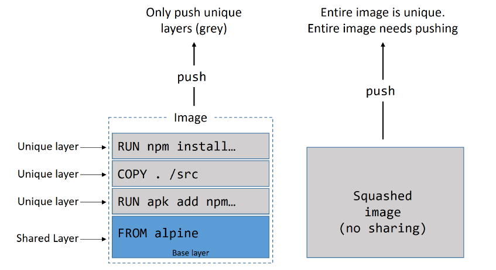

# More best practices for writing Dockerfiles (Advanced) 

## Sources
- [Best practices for writing Dockerfiles](https://docs.docker.com/develop/develop-images/dockerfile_best-practices/)
- [Docker development best practices](https://docs.docker.com/develop/dev-best-practices/)
- [Image-building best practices](https://docs.docker.com/get-started/09_image_best/)

## General guidelines and recommendations

Docker builds images automatically by reading the instructions from a **Dockerfile** -- a text file that contains all commands, in order, needed to build a given image. A Dockerfile adheres to a specific format and set of instructions.

A Docker image consists of read-only layers each of which represents a Dockerfile instruction. The layers are stacked and each one is a delta of the changes from the previous layer. Consider this Dockerfile:

```Dockerfile
# syntax=docker/dockerfile:1
FROM ubuntu:18.04
COPY . /app
RUN make /app
CMD python /app/app.py
```

Each instruction creates one layer:
- `FROM` creates a layer from the ubuntu:18.04 Docker image.
- `COPY` adds files from your Docker client’s current directory.
- `RUN` builds your application with make.
- `CMD` specifies what command to run within the container.

When you run an image and generate a container, you **add a new writable layer** (the “container layer”) on top of the underlying layers. All changes made to the running container, such as writing new files, modifying existing files, and deleting files, are written to this writable container layer.

### Understand build context
When you issue a docker build command, the current working directory is called the **build context**. By default, the Dockerfile is assumed to be located here, but you can specify a different location with the file flag (`-f`). Regardless of where the `Dockerfile` actually lives, all recursive contents of files and directories in the current directory are sent to the Docker daemon as the build context.

Create a directory for the build context and `cd` into it. Write “hello” into a text file named hello and create a `Dockerfile` that runs cat on it. Build the image from within the build context (`.`):

```bash
cd 06_Building_Images/examples/05_context/
mkdir myproject && cd myproject
echo "hello" > hello
echo -e "FROM busybox\nCOPY /hello /\nRUN cat /hello" > Dockerfile
docker build -t helloapp:v1 .
```
Move Dockerfile and hello into separate directories and build a second version of the image (without relying on cache from the last build). Use `-f` to point to the Dockerfile and specify the directory of the build context:

```bash
mkdir -p dockerfiles context
mv Dockerfile dockerfiles && mv hello context
docker build --no-cache -t helloapp:v2 -f dockerfiles/Dockerfile context
```
Inadvertently including files that are not necessary for building an image results in a larger build context and larger image size. This can increase the time to build the image, time to pull and push it, and the container runtime size. To see how big your build context is, look for a message like this when building your Dockerfile:

    Sending build context to Docker daemon  187.8MB

### Minimize the number of layers
In older versions of Docker, it was important that you minimized the number of layers in your images to ensure they were performant. The following features were added to reduce this limitation:
- **Only the instructions `RUN`, `COPY`, `ADD` create layers**. Other instructions create temporary intermediate images, and do not increase the size of the build.
- Where possible, **use multi-stage builds**, and only copy the artifacts you need into the final image. This allows you to include tools and debug information in your intermediate build stages without increasing the size of the final image.

### Sort multi-line arguments
Whenever possible, ease later changes by sorting multi-line arguments alphanumerically. This helps to avoid duplication of packages and make the list much easier to update. This also makes PRs a lot easier to read and review. Adding a space before a backslash (`\`) helps as well.

Here’s an example from the buildpack-deps image:
```Dockerfile

RUN apt-get update && apt-get install -y \
  bzr \
  cvs \
  git \
  mercurial \
  subversion \
  && rm -rf /var/lib/apt/lists/*
```

### Leverage build cache
The build process used by Docker has the concept of a cache that it uses to speed-up the build process. The best way to see the impact of the cache is to build a new image on a clean Docker host, then repeat the same build immediately after. The first build will pull images and take time building layers. The second build will complete almost instantaneously. This is because artefacts from the first build, such as layers, are cached and leveraged by later builds.

When building an image, Docker steps through the instructions in your `Dockerfile`, executing each in the order specified. As each instruction is examined, Docker looks for an existing image in its cache that it can reuse, rather than creating a new (duplicate) image.

If you do not want to use the cache at all, you can use the `--no-cache=true` option on the docker build command. However, if you do let Docker use its cache, it is important to understand when it can, and cannot, find a matching image. The basic rules that Docker follows are outlined below:
- Starting with a parent image that is already in the cache, the next instruction is compared against all child images derived from that base image to see if one of them was built using the exact same instruction. If not, the cache is invalidated.
- In most cases, simply comparing the instruction in the Dockerfile with one of the child images is sufficient. However, certain instructions require more examination and explanation.
- For the `ADD` and `COPY` instructions, the contents of the file(s) in the image are examined and a checksum is calculated for each file. The last-modified and last-accessed times of the file(s) are not considered in these checksums. During the cache lookup, the checksum is compared against the checksum in the existing images. If anything has changed in the file(s), such as the contents and metadata, then the cache is invalidated.
- Aside from the `ADD` and `COPY` commands, cache checking does not look at the files in the container to determine a cache match. For example, when processing a `RUN apt-get -y update` command the files updated in the container are not examined to determine if a cache hit exists. In that case just the command string itself is used to find a match.

Once the cache is invalidated, all subsequent Dockerfile commands generate new images and the cache is not used.

### Squash the image

Squashing an image isn’t really a best practice as it has pros and cons. At a high level, Docker follows the normal process to build an image, but then adds an additional step that squashes everything into a single layer.

Squashing can be good in situations where images are starting to have a lot of layers and this isn’t ideal. An example might be when creating a new base image that you want to build other images from in the future — this base is much better as a single-layer image.

On the negative side, squashed images do not share image layers. This can result in storage inefficiencies and larger push and pull operations.

Add the `--squash` flag to the docker image build command if you want to create a squashed image.


<!-- Vir: Docker Deep Dive, Nigel Poulton -->

Both images are exactly the same except for the fact that one is squashed and the other is not. The non-squashed image shares layers with other images on the host (saving disk space) but the squashed image does not. The squashed image will also need to send every byte to Docker Hub on a docker image push command, whereas the non-squashed image only needs to send unique layers.

### Use no-install-recommends

If you are building Linux images, and using the apt package manager, you should use the `--no-install-recommends` flag with the apt-get install command. This makes sure that apt only installs main dependencies (packages in the Depends field) and not recommended or suggested packages. This can greatly reduce the number of unwanted packages that are downloaded into your images.

> [Example](https://ubuntu.com/blog/we-reduced-our-docker-images-by-60-with-no-install-recommends): We reduced our Docker images by 60% with –no-install-recommends


## Dockerfile instructions

### FROM
Whenever possible, use current official images as the basis for your images. We recommend the Alpine image as it is tightly controlled and small in size (currently under 6 MB), while still being a full Linux distribution.

### LABEL
You can add labels to your image to help organize images by project, record licensing information, to aid in automation, or for other reasons. For each label, add a line beginning with LABEL and with one or more key-value pairs. The following examples show the different acceptable formats. Explanatory comments are included inline.

### RUN
Split long or complex RUN statements on multiple lines separated with backslashes to make your Dockerfile more readable, understandable, and maintainable.

