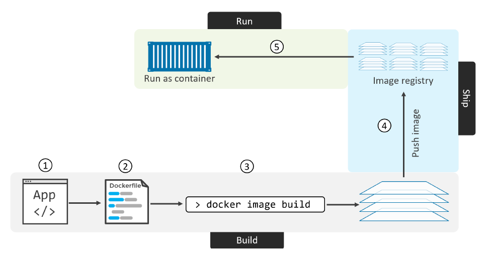
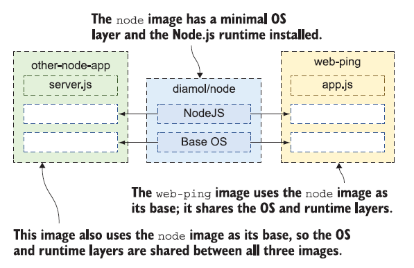

# Building Images

## Overview of Docker Build

Docker Build is one of Docker Engine's most used features. Whenever you are creating an image you are using Docker Build. Build is a key part of your software development life cycle allowing you to package and bundle your code and ship it anywhere.

Docker Build implements a client-server architecture, where:
- Buildx is the client and the user interface for running and managing builds
- BuildKit is the server, or builder, that handles the build execution.


> As of Docker Engine 23.0 and Docker Desktop 4.19, Buildx is the default build client.

**Buildx** is a CLI tool that provides a user interface for working with builds. Buildx is a drop-in replacement for the legacy build client used in earlier versions of Docker Engine and Docker Desktop. In newer versions of Docker Desktop and Docker Engine, you're using Buildx by default when you invoke the `docker build` command. 

**BuildKit**, or buildkitd, is the daemon process that executes the build workloads. A build execution starts with the invocation of a docker build command. Buildx interprets your build command and sends a build request to the BuildKit backend. BuildKit resolves the build instruction and executes the build steps.


## Containerizing an app - overview
The process of taking an application and configuring it to run as a container is called “containerizing”.

The process of containerizing an app looks like this:
1. Start with your application code and dependencies
2. Create a `Dockerfile` that describes your app, its dependencies, and how to run it
3. Feed the `Dockerfile` into the docker image build command
4. Push the new image to a registry (optional)
5. Run container from the image

Once your app is containerized (made into a container image), you’re ready to share it and run it as a container.


<!-- Vir: Docker Deep Dive, Nigel Poulton -->

You can create a Docker image by either modifying an existing image inside a container or defining and executing a build script called a Dockerfile.

## Building your first container image

The **Dockerfile is a simple script you write to package up an application—it’s a set of instructions, and a Docker image is the output**.

Dockerfile syntax is simple to learn, and you can package up any kind of app using a Dockerfile. As scripting languages go, it is very flexible. Common tasks have their own commands, and for anything custom you need to do, you can use standard shell commands.

> The Dockerfile instruction syntax is defined by the specification reference in the [Dockerfile reference](https://docs.docker.com/reference/dockerfile/).

The **default filename** to use for a Dockerfile is Dockerfile, without a file extension. Using the default name allows you to run the docker build command without having to specify additional command flags.

Dockerfile to package up the web-ping application:

```Dockerfile
# syntax=docker/dockerfile:1

FROM node:20-alpine

ENV TARGET="ltfe.org"
ENV METHOD="HEAD"
ENV INTERVAL="3000"

WORKDIR /web-ping
COPY app.js .

CMD ["node", "/web-ping/app.js"]
```

The first line to add to a Dockerfile is a **`# syntax` parser directive**. While optional, this directive instructs the Docker builder what syntax to use when parsing the Dockerfile, and allows older Docker versions with BuildKit enabled to use a specific Dockerfile frontend before starting the build. Parser directives must appear before any other comment, whitespace, or Dockerfile instruction in your Dockerfile, and should be the first line in Dockerfiles.

> It's recommended using docker/dockerfile:1, which always points to the latest release of the version 1 syntax. BuildKit automatically checks for updates of the syntax before building, making sure you are using the most current version.

The Dockerfile instructions are FROM, ENV, WORKDIR, COPY, and CMD; they’re in capitals, but that’s a convention, not a requirement. Here’s the breakdown for each instruction:
- [**`FROM`**](https://docs.docker.com/engine/reference/builder/#from) — Every image has to start from another image. In this case, the web-ping image will use the `node:20-alpine` image as its starting point. This will set the base image for your Dockerfile, which means that subsequent instructions will be applied to this base image. That image has Node.js installed, which is everything the web-ping application needs to run.
- [**`ENV`**](https://docs.docker.com/engine/reference/builder/#env) — Sets values for environment variables. The syntax is `[key]="[value]"`, and there are three ENV instructions here, setting up three different environment variables.
> The environment variables set using `ENV` will persist when a container is run from the resulting image. You can view the values using `docker inspect`, and change them using `docker run --env <key>=<value>`.
- [**`WORKDIR`**](https://docs.docker.com/engine/reference/builder/#workdir) — Creates a directory in the container image filesystem, and sets that to
be the current working directory. If not specified, the default working directory is `/`. In practice, if you aren’t building a Dockerfile from scratch (FROM scratch), the WORKDIR may likely be set by the base image you’re using. Therefore, to avoid unintended operations in unknown directories, it is best practice to set your WORKDIR explicitly.
- [**`COPY`**](https://docs.docker.com/engine/reference/builder/#copy) — Copies files or directories from the local filesystem into the container image. The syntax is `[source path] [target path]` — in this case, I’m copying `app.js` from my local machine into the working directory in the image.
- [**`CMD`**](https://docs.docker.com/engine/reference/builder/#cmd) — Specifies the command to run when Docker starts a container from the image. This runs Node.js, starting the application code in app.js.

> Understanding Dockerfile instructions is not enough to create your Dockerfile, because **you need to also understand the context of the technology** you are building for.

Navigate to the source directory (from docker-k8s folder):
- `cd Part_06_Building_Images/examples/01_ping_app`
- `ls -la`

You should see that you have two files:
- `Dockerfile` (no file extension)
- `app.js`, which has the Node.js code for the web-ping application

In this directory you have everything you need to build your own image for the web-ping application.

Docker needs to know a few things before it can build an image from a Dockerfile. It needs:
- a **name for the image**, 
- and it needs to know the **location for all the files** that it’s going to package into the image.
- `sudo docker image build --tag web-ping .`

The `--tag` argument is the name for the image, and the final argument is the directory where the Dockerfile and related files are. Docker calls this directory the “context,” and the period means “use the current directory.” The build context is the set of files that your build can access.

When you see the “successfully built” and “successfully tagged” messages in the output, your image is built. It’s stored **locally in your image cache**, and you can see it with the Docker command to list images.
- `sudo docker image ls 'w*'`

**Environment variables** are just key/value pairs that the operating system provides. Docker containers also have environment variables, but instead of coming from the computer’s operating system, they’re set up by Docker in the same way that Docker creates a hostname and IP address for the container.

Run a container from your own image to ping Docker’s website every five seconds:
- `sudo docker container run --rm -e TARGET=docker.com -e INTERVAL=5000 web-ping`

The container running interactively because you didn’t use the `-d` flag, so the output from the app is shown on your console. The container will keep running until you end the app by pressing Ctrl-C. The `--rm` flag tells Docker to remove the container when it stops.

## Understanding Docker images and image layers

The Docker image contains all the files you packaged, which become the container’s filesystem, and it also contains a lot of metadata about the image itself. That includes a **brief history** of how the image was built. Check the history for your web-ping image:
- `sudo docker image history web-ping`

The `CREATED BY` commands are the Dockerfile instructions. Each instruction in a Dockerfile roughly translates to an image layer.


A Docker image is a logical collection of image layers. Layers are the files that are physically stored in the Docker Engine’s cache. Here’s why that’s important: **image layers can be shared between different images and different containers**. If you have lots of containers all running Node.js apps, they will all share the same set of image layers that contain the Node.js runtime.


<!-- Vir: Learn Docker in a Month of Lunches, ELTON STONEMAN -->

You can list images with `docker image ls`, which also **shows the size of the image**. If you don’t include a filter in the command, you’ll see all images: 
- `sudo docker image ls`
 
The size column you see is the logical size of the image—that’s how much disk space the image would use if you didn’t have any other images on your system. If you do **have other images that share layers**, the **disk space Docker uses is much smaller**.

The `system df` command shows exactly how much disk space Docker is using:
- `sudo docker system df`

The amount of disk space you save through reuse is typically much larger when you have a large number of application images all sharing the same base layers for the runtime.

Docker enforces that by making **image layers read-only**. Once you create a layer by building an image, that layer **can be shared by other images, but it can’t be changed.**

## Understanding the image layer cache

When you build the same Docker image multiple times, knowing how to optimize the build cache is a great tool for making sure the builds run fast.

There’s a layer of your web-ping image that contains the application’s JavaScript file. If you **make a change to that file and rebuild your image, you’ll get a new image layer**.

Docker assumes the layers in a Docker image follow a defined sequence, so if you change a layer in the middle of that sequence, Docker doesn’t assume it can reuse the later layers in the sequence.

Make a change to the `app.js` file. It doesn’t have to be a code change; just adding a new empty line at the end of the file will do.
- Add a new empty line
- `sudo docker image build -t web-ping:v2 .`

> If you need a full rebuild, you can use the `--no-cache` flag on docker image build to disable the use of the cache.

Steps 2 through 5 of the **build use layers from the cache**, and steps 6 and 7 generate **new layers**.

> The instructions `RUN`, `COPY`, `ADD` mostly contribute to the size of the final Docker image and always create layers. Other directives, don't modify the filesystem since they just add metadata or configurations to the image, so they don't add any layers that increased the file size of the Docker image but only create temporary intermediate layers with 0B in size.

Dockerfile instruction results in an image layer, but if the instruction doesn’t change between builds, and the content going into the instruction is the same, Docker knows it can use the previous layer in the cache. 

Docker calculates whether the input has a match in the cache by **generating a hash**, which is like a digital fingerprint **representing the input**.

The hash is made from the Dockerfile instruction and the contents of any files being copied. If there’s no match for the hash in the existing image layers, Docker executes the instruction, and that breaks the cache. **As soon as the cache is broken**, Docker **executes all the instructions that follow, even if they haven’t changed**.

Any Dockerfile you write should be **optimized so that the instructions are ordered by how frequently they change** — with instructions that are unlikely to change at the start of the Dockerfile, and instructions most likely to change at the end.

Example simpleweb (build the example step by step):
- `cd Part_06_Building_Images/examples/02_simpleweb/`
- Try without different COPY strategies. 
- Check the final Dockerfile: `cat Dockerfile`
    - [**`RUN`**](https://docs.docker.com/engine/reference/builder/#run) - The RUN instruction will execute any commands in a new layer on top of the current image and commit the results. The resulting committed image will be used for the next step in the Dockerfile. 
    - [**`EXPOSE`**](https://docs.docker.com/engine/reference/builder/#expose) - The instruction informs Docker that the container listens on the specified network ports at runtime. You can specify whether the port listens on TCP or UDP, and the default is TCP if the protocol is not specified. The EXPOSE instruction does not actually publish the port. It functions as a type of documentation between the person who builds the image and the person who runs the container, about which ports are intended to be published.
    - [**`ENTRYPOINT`**](https://docs.docker.com/engine/reference/builder/#entrypoint) - An ENTRYPOINT allows you to configure a container that will run as an executable.
- Build the image:
    - `sudo docker build -t simpleweb .`
    - `sudo docker run --rm simpleweb` (webpage not up -> why?)
    - Try with port mapping: `sudo docker run --rm -p 80:8080 simpleweb`

## Understand how CMD and ENTRYPOINT interact

Both `CMD` and `ENTRYPOINT` instructions define what command gets executed when running a container. There are few rules that describe their co-operation.
1. Dockerfile should specify at least one of `CMD` or `ENTRYPOINT` commands.
2. `ENTRYPOINT` should be defined when using the container as an executable.
3. `CMD` should be used as a way of defining default arguments for an `ENTRYPOINT` command or for executing an ad-hoc command in a container.
4. `CMD` will be overridden when running the container with alternative arguments.
5. Only the last `ENTRYPOINT` instruction in the Dockerfile will have an effect.
6. If Dockerfile has more than one `CMD` instruction, all but last `CMD` instructions are ignored.

> If CMD is defined from the base image, setting ENTRYPOINT will reset CMD to an empty value. In this scenario, CMD must be defined in the current image to have a value.

Command line arguments to `docker run <image>` will be appended after all elements in an exec form ENTRYPOINT, and will override all elements specified using CMD. This allows arguments to be passed to the entry point, i.e., `docker run <image> -d` will pass the `-d` argument to the entry point. You can override the ENTRYPOINT instruction using the `docker run --entrypoint` flag.
- `cd Part_06_Building_Images/examples/03_entrypoint_vs_cmd/`
- `sudo docker image build -t entrypointcmd:v1 -f Dockerfile_01 .`
> We can use `--file` , `-f` in docker build command: Name of the Dockerfile (Default is 'PATH/Dockerfile') 
- `sudo docker run --rm entrypointcmd:v1`
- `sudo docker run --rm entrypointcmd:v1 -la`
- `sudo docker run --rm --entrypoint ps entrypointcmd:v1 aux`
- `sudo docker image build -t entrypointcmd:v2 -f Dockerfile_02 .`
- `sudo docker run --rm entrypointcmd:v2`
- `sudo docker run --rm entrypointcmd:v2 ls -la`
- `sudo docker image build -t entrypointcmd:v3 -f Dockerfile_03 .`
- `sudo docker run --rm entrypointcmd:v3`
- `sudo docker run --rm entrypointcmd:v3 -l`

ENTRYPOINT and CMD have two forms:
- The **exec form**, which is the preferred form: `ENTRYPOINT ["executable", "param1", "param2"]`
- The **shell form**: `ENTRYPOINT command param1 param2`

> TIP:  **Using the exec (or string array) form wherever possible is the best practice.** At a minimum, a Dockerfile should be consistent and avoid mixing styles. This will make your Dockerfiles more readable and ensure that instructions behave as you’d expect without detailed understanding of their nuances.

The shell form has the disadvantage that your ENTRYPOINT will be started as a subcommand of `/bin/sh -c`, which **does not pass signals**. This means that the executable **will not be the container’s PID 1** - and will not receive Unix signals - so your executable will not receive a `SIGTERM` from `docker stop <container>`.

- `sudo docker image build -t run_exec -f Dockerfile_04 .`
- `sudo docker image build -t run_shell -f Dockerfile_05 .`
- Exec form: 
    - `sudo docker run -d --rm --name exec run_exec`
    - `sudo docker exec -it exec ps x`
    - `time sudo docker stop exec`
- Shell form:
    - `sudo docker run -d --rm --name shell run_shell`
    - `sudo docker exec -it shell ps x`
    - `time sudo docker stop shell`

> The [table shows](https://docs.docker.com/engine/reference/builder/#understand-how-cmd-and-entrypoint-interact) what command is executed for different ENTRYPOINT / CMD combinations.

- **Prefer ENTRYPOINT** to CMD **when building executable Docker image** and you need a command always to be executed. Additionally use CMD if you need to provide extra default arguments that could be overwritten from command line when docker container runs.
- **Choose CMD** if you need to **provide a default command** and/or arguments that can be overwritten from command line when docker container runs.

## Difference between the COPY and ADD commands

When creating a Dockerfile, it’s often necessary to transfer files from the host system into the Docker image. These could be property files, native libraries, or other static content that our applications will require at runtime.

The Dockerfile specification **provides two ways to copy files from the source system into an image**: the `COPY` and `ADD` directives.

Generally speaking, **`COPY` is preferred**. That’s because it’s more transparent than ADD. COPY only supports the basic copying of local files into the container, while ADD has some features (like local-only tar extraction and remote URL support) that are not immediately obvious.

Because image size matters, **using ADD to fetch packages from remote URLs is strongly discouraged**; you should use curl or wget instead. That way you can delete the files you no longer need after they’ve been extracted and you don’t have to add another layer in your image. For example, you should avoid doing things like:
```Dockerfile
ADD https://example.com/big.tar.xz /usr/src/things/
RUN tar -xJf /usr/src/things/big.tar.xz -C /usr/src/things
RUN make -C /usr/src/things all
```
And instead, do something like:
```Dockerfile
RUN mkdir -p /usr/src/things \
    && curl -SL https://example.com/big.tar.xz \
    | tar -xJC /usr/src/things \
    && make -C /usr/src/things all
```

A valid use case for ADD is when you want to extract a local tar file into a specific directory in your Docker image. If you are copying local files to your Docker image, always use COPY because it’s more explicit.

## Using the VOLUME command inside a Dockerfile

Let's check the current state of the volumes on the system:
- `sudo docker volume ls` (no volumes)
- Run a redis container: `sudo docker run -d --name redis redis:7.2.4-alpine`
- Check the volumes again: `sudo docker volume ls` (one volume)
- Check the volume details: `sudo docker volume inspect <volume_name>`
- Remove the container: `sudo docker rm -f redis`
- Check the volumes again: `sudo docker volume ls` (volume still exists)
- Remove the volume: `sudo docker volume rm <volume_name>`

Why is the volume was created when you ran the container?

There are two ways to use volumes with containers: you can manually create volumes and attach them to a container, or **you can use a VOLUME instruction in the Dockerfile.**

That builds an **image that will create a volume when you start a container**.

The syntax is simply `VOLUME <target-directory>`.
```Dockerfile
# syntax=docker/dockerfile:1

FROM ubuntu:20.04

WORKDIR /data
RUN echo "Hello from Volume" > test

RUN mkdir /uploads

VOLUME /data
VOLUME /uploads

CMD ["sleep", "10000"]
```

> You **cannot specify a directory on the host when defining a volume in a Dockerfile**. This is because host directories are different depending on what OS your Docker host is running – it could break your builds if you specified a directory on a Docker host that doesn’t exist. As a result, defining a volume in a Dockerfile requires you to specify host directories at deploy-time.

When you run a container from this image, Docker will automatically create a volume and attach it to the container. You can see that if you run a container from the image and then check the volumes.
- `cd Part_06_Building_Images/examples/04_volumes/`
- `sudo docker image build -t test_volume .`
- `sudo docker run -d -v uploads_data:/uploads --name test test_volume`
- `sudo docker container inspect test | grep -A 20 Mounts`
- `sudo docker volume ls`

Volumes declared in Docker images are created as a separate volume for each container. Images built with a VOLUME instruction will always create a volume for a container if there is no volume specified in the run command. **The volume will have a random ID**, so you can use it after the container is gone, but only if you can work out which volume has your data.

**Anonymous volumes** are not given an explicit name when they are first mounted into a container, so Docker gives them a random name that is guaranteed to be unique within a given Docker host. Besides the name, named and anonymous volumes behave in the same ways.

If the image does have a volume, the volume flag can override it for the container by using an existing volume for the same target path — so a new volume won’t be created.

**As an image author, you should use the `VOLUME` instruction as a fail-safe option for stateful applications**. That way containers will always write data to a persistent volume even if the user doesn’t specify the volume flag. But **as an image user, it’s better not to rely on the defaults** and to work with named volumes.
- `sudo docker stop test`
- `sudo docker volume ls`
- `sudo docker rm test`
- `sudo docker volume ls`
- `sudo docker run -d -v uploads_data:/uploads --name test test_volume`
- `sudo docker volume ls`
- `sudo docker stop test`
- `sudo docker rm -v test` (Remove anonymous volumes associated with the container)
- `sudo docker volume prune`

## Run containers as non-root user
There are two reasons to avoid running as root, both security related.
1. First, it means your running process will have less privileges, which means if your process is somehow remotely compromised, the attacker will have a harder time escaping the container.
2. Second, and this is a more subtle point, running as a non-root user means you won’t try to take actions that require extra permissions. And that means you can run your container with less “capabilities”, making it even more secure.

What you want is your container running as a non-root user from the start. You can do that in your runtime configuration, but then you have to remember to do that.

So an even **better solution is adding a new user when building the image, and using the Dockerfile `USER` command to change the user you run as**. You won’t be able to bind to ports <1024, but that’s a good thing—that’s another capability (`CAP_NET_BIND_SERVICE`) you don’t need. And since your container is pretty much always behind a proxy of some sort, that's fine.
- `cd Part_06_Building_Images/examples/06_user/`
- `sudo docker run --rm ubuntu:20.04 id`
- `cat Dockerfile`
- `sudo docker image build -t ubuntu-no-root .`
- `sudo docker run --rm ubuntu-no-root id`

## Best practices for writing Dockerfiles

### Keep your images small
Small images are faster to pull over the network and faster to load into memory when starting containers or services. There are a few rules of thumb to keep image size small:
- Start with an appropriate base image. 
- Try to reduce the number of layers in your image by minimizing the number of separate commands in your Dockerfile.
- If you have multiple images with a lot in common, consider creating your own base image with the shared components, and basing your unique images on that. 

For example, if your build contains several layers, you can order them from the less frequently changed (to ensure the build cache is reusable) to the more frequently changed:
- Install tools you need to build your application
- Install or update library dependencies
- Generate your application

### Start your Dockerfile with the steps that are least likely to change
This is easier said than done. Anyway, your image will stabilize after a while and changes will be less likely. The best practice is to structure your Dockerfile according to the following:
1. Install tools that are needed to build your application.
2. Install dependencies, libraries and packages.
3. Build your application.

### Clean up your Dockerfile
Always review your steps in the Dockerfile and only keep the minimum set of steps that are needed by your application. Always remove unnecessary components.

### Containers should be ephemeral (short-lived)
This would belong to generic Docker guidelines, but it’s never enough to stress this point. It is your best interest to design and **build Docker images that can be destroyed and recreated/replaced automatically or with minimal configuration**. Which means that you should create Dockerfiles that define **stateless images**. Any state, should be kept outside of your containers.

### Don’t install unnecessary packages
To reduce complexity, dependencies, file sizes, and build times, avoid installing extra or unnecessary packages just because they might be “nice to have.” For example, you don’t need to include a text editor in a database image.

### One container should have one concern - decouple applications
Each container should have only one concern. Decoupling applications into multiple containers makes it easier to scale horizontally and reuse containers. For instance, a web application stack might consist of three separate containers, each with its own unique image, to manage the web application, database, and an in-memory cache in a decoupled manner.

Limiting each container to one process is a good rule of thumb, but it is not a hard and fast rule. For example, not only can containers be spawned with an init process, some programs might spawn additional processes of their own accord. For instance, Celery can spawn multiple worker processes, and Apache can create one process per request.

Use your best judgment to keep containers as clean and modular as possible. If containers depend on each other, you can use Docker container networks to ensure that these containers can communicate.

### Exclude with .dockerignore
The directory where you issue the docker build command is called the build context. Docker will send all of the files and directories in your build directory to the Docker daemon as part of the build context. If you have stuff in your directory that is not needed by your build, you’ll have an unnecessarily larger build context that results in a larger image size.

To exclude files not relevant to the build (without restructuring your source repository) use a `.dockerignore` file. This file supports exclusion patterns similar to `.gitignore` files. 

> More about [.dockerignore file](https://docs.docker.com/engine/reference/builder/#dockerignore-file)

### Security scanning
When you have built an image, it is a good practice to scan it for security vulnerabilities using the docker scan command. Docker has partnered with Snyk to provide the vulnerability scanning service.

## Example: Build a Python application
Let’s create a simple Python application using the Flask framework that we’ll use as our example. Let's check the files:
- `cd Part_06_Building_Images/examples/07_python_app/`
- `ls -la`
- `cat .dockerignore`
> You can even use the `.dockerignore` file to exclude the `Dockerfile` and `.dockerignore` files. These files are still sent to the daemon because it needs them to do its job. But the ADD and COPY instructions do not copy them to the image.
- `cat Dockerfile.prod`
    - The LABEL instruction is used to define key/value pairs that are recorded as additional metadata for an image or container.
    - **Naming Dockerfiles**: The default and most common name for a Dockerfile is Dockerfile. However, Dockerfiles can be named anything because they are simple text files and the build command accepts any filename you tell it.

Put it all together by running the docker image build command from the directory where the mailer-base file is located. The -f flag tells the builder which filename to use as input:
- `sudo docker image build -t smart-api -f Dockerfile.prod .`
- `sudo docker run --rm -d --name smart-api -p 80:5000 smart-api`
- `sudo docker exec smart-api id`
- `sudo docker exec smart-api ps aux`
- `sudo docker stop smart-api`

## Use multi-stage builds

The aim of the game is to only ship production images with the stuff needed to run your app in production.

One of the **most challenging things about building images is keeping the image size down**. Each instruction in the Dockerfile adds a layer to the image, and you need to remember to clean up any artifacts you don’t need before moving on to the next layer. To write a really efficient Dockerfile, you have traditionally needed to employ **shell tricks and other logic to keep the layers as small as possible** and to ensure that each layer has the artifacts it needs from the previous layer and nothing else.

Multi-stage builds have a **single Dockerfile containing multiple FROM instructions**. Each FROM instruction is a new build stage that can easily **COPY artefacts from previous stages**. You can selectively copy artifacts from one stage to another, leaving behind everything you don’t want in the final image.

> Check for language specific tutorials. [Python](https://pythonspeed.com/articles/smaller-python-docker-images/) / [Java](https://dzone.com/articles/multi-stage-docker-image-build-for-java-apps) / [Go](https://docs.docker.com/develop/develop-images/multistage-build/#use-multi-stage-builds) / [NodeJS](https://cloudnweb.dev/2019/10/crafting-multi-stage-builds-with-docker-in-node-js/)

To show how this works, let’s adapt the Dockerfile from the previous section to use multi-stage builds.
- `cd Part_06_Building_Images/examples/08_python_app_multi_stage/`
- `sudo docker image ls smart-api` (size of the image)
- `cat Dockerfile.prod`
- `sudo docker image build -t smart-api-prod -f Dockerfile.prod .`
- `sudo docker run --rm -d --name smart-api -p 80:5000 smart-api-prod`
- `sudo docker image ls smart-api-prod` (size of the image)
- `sudo docker stop smart-api`


## Build secrets
A build secret is any piece of sensitive information, such as a password or API token, consumed as part of your application's build process.

Build arguments and environment variables are inappropriate for passing secrets to your build, because they persist in the final image. Instead, should use secret mounts or SSH mounts, which expose secrets to your builds securely.

### Secret mounts
Secret mounts expose secrets to the build containers as files. You mount the secrets to the `RUN` instructions that need to access them, similar to how you would define a bind mount or cache mount.

```Dockerfile
RUN --mount=type=secret,id=mytoken \
    TOKEN=$(cat /run/secrets/mytoken) ...
```

To pass a secret to a build, use the docker build --secret flag:
- `docker build --secret id=mytoken,src=$HOME/.aws/credentials .`

### SSH mounts

[More here](https://docs.docker.com/build/building/secrets/#ssh-mounts).

## More best practices for writing Dockerfiles (Advanced) 

[More here](./More_best_practices_for_writing_Dockerfiles_Advanced.md).

## Building Docker images from a container (Advanced)

[More here](./Building_Docker_images_from_a_container_Advanced.md).

## Building and Testing Multi-Arch Images (Advanced)

[More here](./Building_and_Testing_Multi-Arch_Images_Advanced.md).

## Building Wasm Images (Advanced)

[More here](./Building_Wasm_Images_Advanced.md).

## Generate the SBOM for Docker images (Advanced)

[More here](./Generate_the_SBOM_for_Docker_images_Advanced.md).
