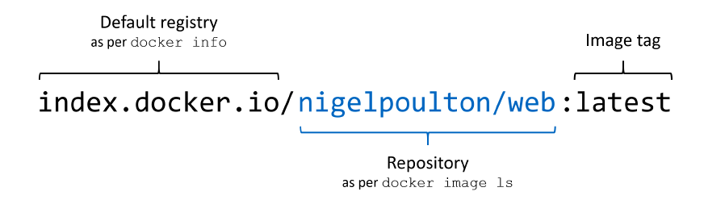

# Sharing Docker Images

## Working with registries, repositories, and image tags

**Sharing** is all about taking the images you’ve built on your local machine and **making them available for other people to use**. Packaging your software along with all its dependencies means anyone can use it easily, on any machine—there are no gaps between environments, so there are no more days wasted setting up software or tracking down bugs that are actually deployment problems.

The **server that stores images centrally is called a Docker registry**. Docker Hub is the most popular image registry, hosting hundreds of thousands of images, which are downloaded billions of times every month. Is a public registry you can use for **free**. Docker Hub also has a **[web interface](https://hub.docker.com/search?q=)**. It’s also the **default registry for the Docker Engine**, which means it’s the first place Docker looks for images that aren’t available locally.

**Docker images need a name**, and that name contains enough information for Docker to find the exact image you’re looking for.

**On your local machine you can name images anything you like**, but when you want to share them on a registry, you’ll need to add some more details, because the image reference is a unique identifier for one specific image on a registry.

The **default registry is Docker Hub**, and the **default tag is latest**. Docker Hub’s domain is `docker.io`. The name contains an organization ID on Docker Hub, and a repository within that organization.
- `<REGISTRY>/<ORGANIZATION_ID>/<REPOSITORY>:TAG`

<!-- Vir: Docker Deep Dive, Nigel Poulton -->

**Tags are used to identify different versions of the same application.** If you don’t specify a tag when you create an image, Docker uses the default tag `latest`. That's a misleading name, because the image tagged “latest” might not actually be the most recent image version. When you push your own images, you should **always tag them with explicit versions**.

> When you’re looking for software to install, always pay careful attention
to the tags offered in a repository. Many repositories publish multiple
releases of their software, sometimes on multiple operating systems or in full or slim versions to support different use cases. Consult the repository's documentation for specifics of what the repository's tags mean and the image release practices.

## Create a repo on Docker Hub

A Docker ID allows you to access Docker Hub which is the world’s largest library and community for container images.

Create a [Docker ID for free](https://hub.docker.com/signup) if you don’t have one.

To push an image, we first need to create a repository on Docker Hub.
- Sign in to [Docker Hub](https://login.docker.com/u/login).
- Click the Create Repository button.
- For the repo name, use `web-ping`. Make sure the Visibility is Public.
- Click the Create button!

> Docker Hub creates a new repository for an image if it doesn’t already exist, and by default that repository has public read rights.

Docker offers **private repositories** which allows you to restrict content to specific users or teams. There is one private repository for free per user. For more check [here](https://www.docker.com/pricing?utm_source=docker&utm_medium=webreferral&utm_campaign=docs_driven_upgrade).

**Private repositories** are similar to public repositories from an operational and product perspective. Most registry providers offer both options, and any differences in provisioning through their websites will be minimal. Because the Docker registry API makes no distinction between the two types of repositories, registry providers that offer both generally require you to provision private registries through their website, app, or API. The tools for working with private repositories are identical to those for working with public repositories, with one exception. Before you can use docker image pull or docker container run **to install an image from a private repository, you need to authenticate with the registry** where the repository is hosted. To do so, you use the `docker login` command just as you would if you were using docker image push to upload an image.

**Public repositories** on hosted registries are the best choice for owners of open source projects or people who are just getting started with Docker. **People should still be skeptical of software that they download** and run from the internet, so public repositories that don’t expose their sources can be difficult for some users to trust. [Hosted (trusted) builds](https://hub.docker.com/search?q=&image_filter=official) solve this problem to a certain extent.

- **Verified publishers** are companies like Microsoft, Oracle, and IBM, who publish images on Docker Hub. Their images go through an approval process that includes security scanning for vulnerabilities; they may also be certified, which means they have the backing of Docker and the publisher. If you want to run off-the-shelf software in containers, certified images from verified publishers are the best bet.
- **Official images** are something different—they’re usually open source projects, maintained jointly by the project team and Docker. They’re security scanned and regularly updated, and they conform to Dockerfile best practices. All the content for the official images is open source, so you can see the Dockerfiles on GitHub. Most people start using official images as the base for their own images.

## Pushing your own images to Docker Hub

You need to **log in to the registry with the Docker command line**, so Docker can check that your user account is authorized to push images. It’s actually the Docker Engine that pushes and pulls images, but you authenticate using the Docker command line—when you run the login command, it will ask for your password, which is your Docker Hub password.
- `sudo docker login --username <USERNAME>`

> [Provide a password using STDIN](https://docs.docker.com/engine/reference/commandline/login/#provide-a-password-using-stdin): To run the docker login command non-interactively, you can set the `--password-stdin` flag to provide a password through STDIN. Using STDIN prevents the password from ending up in the shell’s history, or log-files. Example: `cat ~/my_password.txt | docker login --username foo --password-stdin`

> **Logging Into Private Registries**: `docker login` also lets you login to self-hosted registries. Supply your registry’s hostname and port as the command’s first argument. Docker Hub is always used when no argument is given. Example: `docker login registry.example.com`

Now that you’re logged in, you can push images to your own account or to any
organizations you have access to.

Then you need to **give your image a reference that includes the name of an account** where you have permission to push. That image reference doesn’t have an account name, so you can’t push it to any registries. You don’t need to rebuild the image to give it a new reference though—images can have several references.
- `sudo docker image tag web-ping:v2 <USER_ID>/web-ping:v1`
- `docker image ls`

Now you have two references; one has an account and version number, but both references point to the same image. Images also have a unique ID, and you can see when you list them if a single image ID has multiple references.

The `docker image push` command is the counterpart of the pull command; it uploads your local image layers to the registry.
- `sudo docker image push <USER_ID>/web-ping:v1`
- Check Docker Hub
- Use the following command to find images owned by a specific user:
    - `sudo docker search <USER_ID>`

Docker registries work at the level of image layers in the same way as the local Docker Engine. You push an image, but Docker actually uploads the image layers. In the output you’ll see a list of layer IDs and their upload progress.

The fact that registries work with image layers is another reason why you need to spend time optimizing your Dockerfiles. Layers are **only physically uploaded to the registry if there isn’t an existing match** for that layer’s hash. It’s like your local Docker Engine cache, but applied across all images on the registry.

## Run the image on a new instance
Now that our image has been built and pushed into a registry, let’s try running our app on a brand new instance that has never seen this container image! To do this, we will use Play with Docker.
1. Open your browser to [Play with Docker](https://labs.play-with-docker.com/).
2. Click Login and then select docker from the drop-down list.
3. Connect with your Docker Hub account.
4. Once you’re logged in, click on the ADD NEW INSTANCE option on the left side bar. If you don’t see it, make your browser a little wider. After a few seconds, a terminal window opens in your browser.
5. In the terminal, start your freshly pushed app.
    - `docker container run --rm -e TARGET=google.com leon11sj/web-ping:v1`

## Introducing self-hosted registries

The simplest way to distribute your images is by using **hosted registries**.
A hosted registry is a Docker registry service that’s **owned and operated by a thirdparty vendor**. Docker Hub, Quay.io, and Google Container Registry are all examples of hosted registry providers.

Large companies usually have their own Docker registry in their own cloud environment or their local network. When you have a **hard requirement on availability control, longevity control, or secrecy, then running a self-hosted registry may be your best option**. 

In doing so, you gain control without sacrificing interoperability with Docker pull and push mechanisms or adding to the learning curve for your environment. 

People can interact with a self-hosted registry exactly as they would with a hosted registry. Many free and commercially supported software packages are available for running a Docker image registry.
- [Docker Registry 2.0](https://docs.docker.com/registry/): The Registry is a stateless, highly scalable server side application that stores and lets you distribute Docker images. The Registry is open-source, under the permissive Apache license.
- [GitLab Container Registry](https://docs.gitlab.com/ee/user/packages/container_registry/): GitLab has its own container registry that’s free to use and supports Docker container images as well as Helm Chart (still in beta). It can be self-hosted if you use the self-hosted version of GitLab or cloud-based through GitLab.com.
- [Harbor Container Registry](https://goharbor.io/): Harbor is an open source registry that secures artifacts with policies and role-based access control, ensures images are scanned and free from vulnerabilities, and signs images as trusted. Harbor, a CNCF Graduated project, delivers compliance, performance, and interoperability to help you consistently and securely manage artifacts across cloud native compute platforms like Kubernetes and Docker.
- [Sonatype Nexus Repository OSS](https://www.sonatype.com/products/nexus-repository): Is another self-hosted container registry solution that supports other language packages as well. Sonatype has a Docker image that allows you to deploy it easily in your infrastructure. 
- [Project Quay](https://www.projectquay.io/): Quay is a container image registry that enables you to build, organize, distribute, and deploy containers. Quay gives you security over your repositories with image vulnerability scanning and robust access controls. Project Quay provides a scalable open source platform to host container images across any size organization.

If your organization has a commercial artifact repository for operating system or application software packages, it probably supports the Docker image registry API. A simple option for running a nonproduction image registry is to
use Docker’s registry software. 

The biggest trade-off when going from hosted registries to private registries is gaining flexibility and control while requiring greater depth and breadth of engineering experience to build and maintain the solution. 

## Running and using your own Docker registry

It’s useful to run your own registry on your local network. It cuts down on bandwidth use and transfer times, and it lets you own the data in your environment.

Docker maintains the core registry server on GitHub in the source code repository [docker/distribution](https://github.com/distribution/distribution). It gives you the basic functionality to push and pull images, and it uses the same layer cache system as Docker Hub, but it doesn’t give you the web UI you get with Hub. It’s a super-lightweight server so you can run it in a container.

Use a command like the following to start the registry container:
- `sudo docker run -d -p 5000:5000 --restart=always --name registry registry:2`
- `sudo docker ps`

You now have a registry server on your local machine. The default port for the server is 5000, which this command publishes. You can tag images with the domain `localhost:5000` and push them to this registry. 

Your local registry doesn’t have any authentication or authorization set up. That’s obviously not production quality, but it might work for a small team, and it does let you use your own image-naming schemes.

You can pull an image from Docker Hub and push it to your registry. The following example pulls the `ubuntu:20.04` image from Docker Hub and re-tags it as `my-ubuntu`, then pushes it to the local registry. Finally, the `ubuntu:20.04` and `my-ubuntu` images are deleted locally and the `my-ubuntu` image is pulled from the local registry.
- Pull the ubuntu:20.04 image from Docker Hub: `sudo docker pull ubuntu:20.04`
- You target your own registry by including the domain name in the first part of the reference, so Docker knows not to use Docker Hub. Tag the image as `localhost:5000/my-ubuntu`. This creates an additional tag for the existing image. When the first part of the tag is a hostname and port, Docker interprets this as the location of a registry, when pushing.
    - `sudo docker tag ubuntu:20.04 localhost:5000/my-ubuntu`
- Push the image to the local registry running at localhost:5000: `sudo docker push localhost:5000/my-ubuntu`
- Remove the locally-cached images, so that you can test pulling the image from your registry:
    - `sudo docker image remove ubuntu:20.04`
    - `sudo docker image remove localhost:5000/my-ubuntu`
- Pull the localhost:5000/my-ubuntu image from your local registry: `sudo docker pull localhost:5000/my-ubuntu`
- Stop a local registry: `sudo docker container stop registry && sudo docker container rm -v registry`

## Using image tags effectively
You can put any string into a Docker image tag, and as you’ve already seen, you can **have multiple tags for the same image**. You’ll use that to version the software in your images and let users make informed choices about what they want to use—and to make your own informed choices when you use other people’s images.

Many software projects use a **numeric versioning scheme** with decimal points to indicate how big a change there is between versions, and you can do that with your image tags. The basic idea is something like `[major].[minor].[patch]`, which has some implicit guarantees. 
- A release that only increments the patch number might have bug fixes, but it should have the same features as the last version; 
- A release that increments the minor version might add features but shouldn’t remove any; 
- A major release could have completely different features.

If you use the same approach with your image tags, you can let users choose whether to stick to a major version or a minor version, or just always have the latest release.

This is a **typical versioning scheme you’ll see for Docker images**. It’s one you should adopt yourself, because it lets users of your image choose how current they want to be.

It’s **especially important to use specific image tags for the base images in your own Dockerfiles**. It’s great to use the product team’s build tools image to build your apps and their runtime image to package your apps, but if you don’t specify versions in the tags, you’re setting yourself up for trouble in the future. A new release of the build image could break your Docker build. Or worse, a new release of the runtime could break your application.

## Configure the credentials store (Advanced)

More [here](https://docs.docker.com/reference/cli/docker/login/#configure-the-credential-store).
