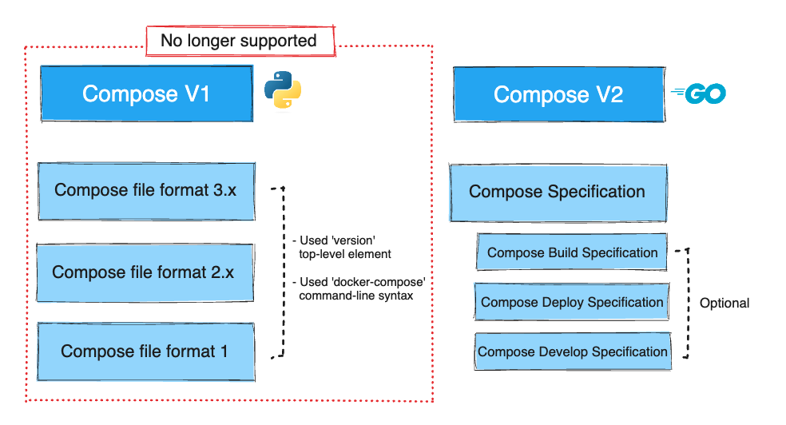

# Running Multi-container Apps With Docker Compose

## Overview of Docker Compose and installation
Compose is a tool for defining and running **multi-container Docker applications in single-engine mode**. With Compose, you use a YAML file to configure your application’s services. Then, with a single command, you create and start all the services from your configuration. 

> **Compose V2 and the new docker compose command**: Effective July 2023, Compose V1 stopped receiving updates and is no longer in new Docker Desktop releases. Compose V2 has replaced it and is now integrated into all current Docker Desktop versions. You can run Compose V2 by replacing the hyphen (-) with a space, using `docker compose`, instead of `docker-compose`. [Compose command compatibility with docker-compose](https://docs.docker.com/compose/cli-command-compatibility/).

[Compose installation scenarios](https://docs.docker.com/compose/install/):
- (Mac, Win, Linux) Docker Desktop: If you have Desktop installed then you already have the Compose plugin installed.
- Linux systems: To install the Docker CLI’s Compose plugins use one of these methods of installation:
    - Using the [convenience scripts](https://docs.docker.com/engine/install/#server) offered per Linux distro from the Engine install section.
    - Setting up [Docker’s repository](https://docs.docker.com/compose/install/compose-plugin/#install-using-the-repository) and using it to install the compose plugin package.

Use the following command to ckeck that Compose is installed: `docker compose version`

## Compose background
Most applications don’t run in one single component. Even large old apps are typically built as frontend and backend components, which are separate logical layers running in physically distributed components.

Modern cloud-native apps are made of **multiple smaller services** that interact to form a useful app. We call this pattern **“microservices”**. A simple example might be an app with the following seven services: Web front-end, Ordering, Catalog, Back-end database, Logging, Authentication, Authorization.
- Get all of these working together, and you have a useful application.
- **Deploying and managing lots of small microservices** like these can be hard. this is where Docker Compose comes in to play.
- Instead of gluing each microservice together with scripts and long docker commands, Docker Compose lets you describe an entire app in a **single declarative configuration file**, and deploy it with a single command.
- Once the app is deployed, you can **manage its entire lifecycle** with a simple set of commands. You can even store and manage the configuration file in a **version control system**.
- Very neat way of describing the setup for complex distributed apps in a small, clear file format.

Main features of Compose:
- **Multiple isolated environments on a single host**: Compose uses a project name to isolate environments from each other. It prevents different projects and service from interfering with each other.
- **Preserve volume data when containers are created**: Compose preserves all volumes used by your services.
- **Only recreate containers that have changed**: Compose caches the configuration used to create a container.
- **Variables and moving a composition between environments**: Compose supports variables in the Compose file. You can use these variables to customize your composition for different environments, or different users.
- **Portability**: Docker Compose lets you bring up a complete development environment with only one command. This allows us developers to keep our development environment in one central place and helps us to easily deploy our applications.

**The Docker Compose file describes the desired state of your app—what it should look like when everything’s running.**

## Running a application with Compose: icta_app_minimal

Compose uses YAML files to define multi-service applications. The default name for a Compose YAML file is `docker-compose.yml`. However, you can use the `-f` flag to specify custom filenames.

The following example shows a very simple Compose file that defines a small **FastApi app with two microservices** (icta-app-api and icta-app-redis). The app is a simple web server that **counts the number of visits to a web page** and stores the value in Redis.

The app files can be found here (check the files): 
  - `cd Part_08_Running_Multi_container_Apps_With_Docker_Compose/examples/01_icta_app_minimal`
  - `ls -la`
  - `cat main.py` (the application code)
  - `cat Dockerfile` (describes how to build the image)
  - `cat requirements.txt` (lists the Python packages required for the app)
  - `cat docker-compose.yml` (the Compose file)

> The most current, and recommended [Compose Specification](https://docs.docker.com/compose/compose-file/).

The first thing to note is that the file has 4 top-level keys:
- `name`: The top-level name property is defined by the Specification as the project name to be used if you don't set one explicitly. Compose offers a way for you to override this name, and sets a default project name to be used if the top-level name element is not set.

> You may see the `version` key in older Compose files. This key is **deprecated**. The top-level version property is defined by the Compose Specification for backward compatibility. It is only informative. Compose doesn't use version to select an exact schema to validate the Compose file, but prefers the most recent schema when it's implemented.

- `services`: The top-level services key is where you define the different application microservices. This example defines two services; an API service and an in-memory database called Redis. Compose will **deploy each of these services as its own container**. 
- `networks`: The top-level networks key tells Docker to create new networks. By default, Compose will create bridge networks. These are single-host networks that can only connect containers on the same Docker host.
- `volumes`: The top-level volumes key is where you tell Docker to create new volumes.

It’s important to understand that Compose will deploy each of these as a container, and it will use the name of the keys as part of the container names. The services section has two second-level keys:
- `icta-app-api`
    - `build`: This tells Docker to build a new image using the instructions in the Dockerfile in the current directory (.). The newly built image will be used in a later step to create the container for this service.
    - `command` this tells Docker the command to run in the container. The command **overrides the default command declared by the container image** (i.e. by Dockerfile’s CMD).
    - `tty`: This tells Docker to allocate a pseudo-TTY for the container. This is useful for running interactive commands in the container and better output formatting.
    - `ports`: Tells Docker to map port 8000 inside the container to port 80 on the host. This means that traffic sent to the Docker host on port 80 will be directed to port 8000 on the container. The app inside the container listens on port 8000.
    - `networks`: Tells Docker which network to attach the service’s container to. The network should already exist, or be defined in the networks top-level key.

    > By default Compose sets up a single network for your app. Each container for a service joins the default network and is both reachable by other containers on that network, and discoverable by them at a hostname identical to the container name.

- `icta-app-redis`
    - `image`: this tells Docker to start a standalone container called redis based on the redis:alpine image. This image will be pulled from Docker Hub.
    - `volumes`: Tells Docker to mount the icta-app-redis-data volume to /data inside the container. The icta-app-redis-data volume needs to already exist, or be defined in the volumes top-level key at the bottom of the file.

The service name becomes the container name and the DNS name of the container, which other containers can use to connect on the Docker network. As both services will be deployed onto the same counter-net network, they **will be able to resolve each other by name**. This is important as the application is configured to communicate with the redis service by name.

Let's see the Docker Compose workflow:
- Let’s use Compose to bring the app up: `sudo docker compose up --build`.
  - `docker compose up` is the most common way to bring up a Compose app (we’re calling a multi-container app defined in a Compose file a Compose app). It builds or pulls all required images, creates all required networks and volumes, and starts all required containers. By default, `docker compose up` expects the name of the Compose file to `docker compose.yml.` If your **Compose file has a different name**, you need to specify it with the `-f` flag.
- It’ll take a few seconds for the app to come up, and the output can be quite verbose.
- Go to: `http://<IP>/hits`
- Press `Ctrl+C` to stop the app.
- Run the app in the background: `sudo docker compose up -d`
  - It’s also common to use the `-d` flag to bring the app up in the background. Now that the app is built and running, we can use normal docker commands to view the images, containers, networks, and volumes that Compose created.
- `sudo docker compose ps`: Show the current state of the app
> You can override the project name with either the `--project-name` flag or the `COMPOSE_PROJECT_NAME` environment variable.
- `sudo docker compose top`: List the processes running inside of each service (The PID numbers returned are the PID numbers as seen from the Docker host (not from within the containers).)
- `sudo docker compose logs`: Show the apps logs.
- `sudo docker compose logs -f`: Follow log output.
- `sudo docker container ls`: The following container listing shows two running containers.
- `sudo docker network ls`
- `sudo docker volume ls`
- `sudo docker compose down` will stop and delete a running Compose app. It deletes containers and networks, but not volumes and images. It’s important to note that the volume was not deleted.This is because volumes are intended to be long-term persistent data stores. As such, their lifecycle is entirely decoupled from the applications they serve. If you’d written any data to the volume, that data would still exist.
- `sudo docker volume ls`
- Rerun the app: `sudo docker compose up -d --build` and check the page again. The counter continues to increment from where it left off.
- `sudo docker compose stop`: Stop the app without deleting its resource
- `sudo docker compose ps`
- `sudo docker compose restart`: Restart the app
- `sudo docker compose ps`
- `sudo docker compose down -v`: Stop and delete the app and the volumes.

## Development with Compose: icta_app_development

We can use Compose in the development stage for our apps:
- Move to: `cd Part_08_Running_Multi_container_Apps_With_Docker_Compose/examples/02_icta_app_development`
- Check the `docker-compose.dev.yml` file in your project directory.
  - The new volumes key mounts the project directory (current directory) on the host to `/code` inside the container, **allowing you to modify the code on the fly, without having to rebuild the image**. 
  - The environment key sets the `REDIS_HOST` and `REDIS_PORT` environment variables for the icta-app-api service. These variables are used in the app to connect to the Redis service.
  - The command was changed to enable **the app reload on code changes.** This mode should only be used in development.
- From your project directory, type docker compose up to build the app with the updated Compose file, and run it.
  - `sudo docker compose -f docker-compose.dev.yml up -d --build`
  - `sudo docker compose -f docker-compose.dev.yml ps`
  - Check the page in a web browser again, and refresh to see the count increment.
  - Because the application code is now mounted into the container using a volume, you can **make changes to its code** and see the changes instantly, without having to rebuild the image.
  - Change the `main.py` file with the content of the `main_updated.py` file and save it. Refresh the app in your browser. The app should be updated, and the counter should still be incrementing.
- Stop the service: `sudo docker compose -f docker-compose.dev.yml down -v`

## Production deployment with Compose: icta_app_production

Moving along, for production environments, we need to add the following:
- Move to folder: `cd Part_08_Running_Multi_container_Apps_With_Docker_Compose/examples/03_icta_app_production`
- A new Dockerfile called `Dockerfile.prod` for use with production builds. We used a Docker multi-stage build to reduce the final image size.
- Build the image: `sudo docker build -t leon11sj/icta-app:v1.0 -f ./Dockerfile.prod .`
  - `sudo docker image ls`: The new image should be smaller than the development image.
- Create a new Compose file called `docker-compose.prod.yml` for production.
  - Add new networks
  - `depends_on` expresses startup and shutdown dependencies between services.
  - Add Nginx into the mix to act as a reverse proxy for the API to handle client requests as well as serve up static files.
- Run the app: `sudo docker compose -f docker-compose.prod.yml up -d`
- Show the logs of the app: `sudo docker compose -f docker-compose.prod.yml logs -f`
- Check the app: `http://<IP>/hits`
- Check the page in a web browser again, and refresh to see the count increment.
- Try to call the API with the prepared script (from another terminal):
  - `chmod +x test_api_script.sh`
  - Call tha API once per second: `./test_api_script.sh <URL> 1`
  - Try to call without sleep: `./test_api_script.sh <URL> 0.01`
- Stop the app: `sudo docker compose -f docker-compose.prod.yml down -v`

## Scaling and Load Balancing using Compose

Each service defined in Docker compose configuration can be scaled. The `icta-app-api` service is effectively stateless, so you can scale it up to run on multiple containers. When the `nginx` container requests data from the `icta-app-api`, Docker will share those requests across the running `icta-app-api` containers.

In the same terminal session, use Docker Compose to increase the scale of the `icta-app-api` service, and then refresh the web page a few times and check the hostname of the containers:
- `sudo docker compose -f docker-compose.prod.yml up -d`
- `sudo docker compose -f docker-compose.prod.yml ps`
- Try to call the script without sleep: `./test_api_script.sh <URL> 0.01` (from another terminal)
- Scale up: 
  - `sudo docker compose -f docker-compose.prod.yml up -d --scale icta-app-api=3`
  - `sudo docker compose -f docker-compose.prod.yml ps`

Docker Compose is a client-side tool. It’s a command line that sends instructions to the Docker API based on the contents of the Compose file. Docker itself just runs containers; it isn’t aware that many containers represent a single application. Only Compose knows that, and Compose only knows the structure of your application by looking at the Docker Compose YAML file, so you need to have that file available to manage your app.

> It’s possible to get your application out of sync with the Compose file, such as when the Compose file changes or you update the running app. That can cause unexpected behavior when you return to manage the app with Compose.

Containers plugged into the same Docker network will get IP addresses in the same network range, and they connect over that network. Using DNS means that when your containers get replaced and the IP address changes, your app still works because the DNS service in Docker will always return the current container’s IP address from the domain lookup.

Connect to a session in the `nginx` container and perform a DNS lookup: `sudo docker container exec -it icta-app-icta-app-nginx-1 sh`
- `nslookup icta-app-api`
- `ping icta-app-api` 
- `ping icta-app-api` 
- `ping icta-app-api`

In the DNS lookup for the `icta-app-api`, you can see that three IP addresses are returned, one for each of the three containers in the service.

DNS servers can return multiple IP address for a domain name. Docker Compose uses this mechanism for simple load-balancing, returning all the container IP addresses for a service. It’s up to the application that makes the DNS lookup how it processes multiple responses; some apps take a simplistic approach of using the first address in the list. 

To try to **provide load-balancing across all the containers**, the Docker DNS returns the list in a different order each time. 
- `nslookup icta-app-api`
- `nslookup icta-app-api`
- `nslookup icta-app-api`
- `exit`

You’ll see that if you repeat the nslookup call - it’s a basic way of trying to spread traffic around all the containers.

Few more steps:
- Scale down: `sudo docker compose -f docker-compose.prod.yml up -d --scale icta-app-api=1`
- `sudo docker compose -f docker-compose.prod.yml ps`
- Stop the script in the other terminal: `Ctrl+C`
- Stop the app: `sudo docker compose -f docker-compose.prod.yml down -v`

## Advanced Compose features (Advanced)
More [here](./Advanced_Compose_features.md).

## Example: Run ownCloud in Docker Compose

[ownCloud](https://owncloud.com/) is a self-hosted open-source file sync and share server. It provides access to your data through a web interface, sync clients, or WebDAV while providing a platform to view, sync, and share across devices easily—all under your control. ownCloud’s open architecture is extensible via a simple but powerful API for applications and plugins and it works with any storage.

On the following [link](https://doc.owncloud.com/server) you can find all the information about the ownCloud Classic Server.

In our case, we will install ownCloud using Docker.

> Precise instructions for Docker installation can be found [here](https://doc.owncloud.com/server/10.14/admin_manual/installation/docker/).

The installation is done as follows:
1. Move to the folder: `cd Part_08_Running_Multi_container_Apps_With_Docker_Compose/examples/04_owncloud_example`
2. Open the file: `nano .env` and change `OWNCLOUD_DOMAIN` and `OWNCLOUD_TRUSTED_DOMAINS` according to the IP that the VM has.
3. Run the command: `sudo docker compose up -d`
4. After the installation is complete, check if all containers are running with the command: `sudo docker compose ps`. If any container still has the status `running (starting)` you can check the logs in more detail with the command `sudo docker compose logs --follow owncloud`.
5. Go to the address `http://<IP>` in the browser and log in to ownCloud (usr: admin, pass: admin).
6. After logging in, you can browse the website and test various functionalities (uploading documents, sharing documents, adding users...).
7. After you are done, you can remove the installation with the command `sudo docker compose down -v`.
