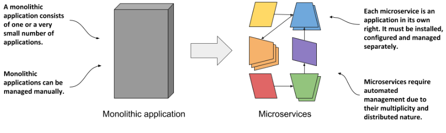
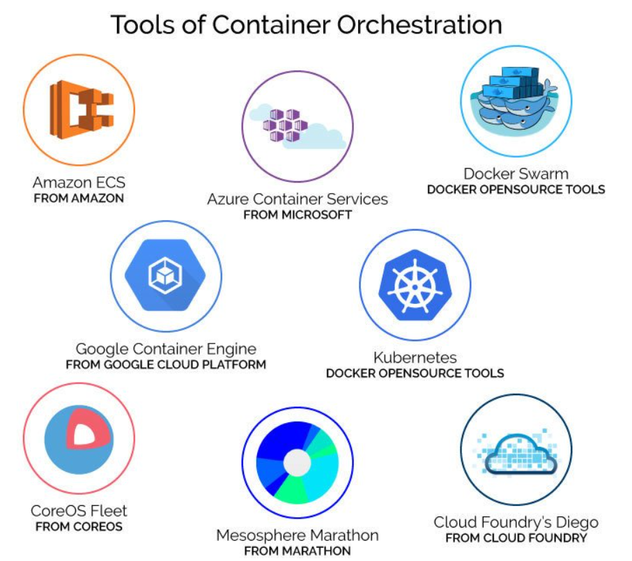

# Container orchestration and microservices

## Traditional applications
- In the past, most applications were large monoliths. The components of the application were **tightly coupled**, and they all **ran in a single computer process**.
- The application was developed as a unit by a **large team of developers** and the deployment of the application was straightforward.
- You installed it on a powerful computer and provided the **little configuration it required**.
- Scaling the application horizontally was rarely possible, so whenever you needed to increase the capacity of the application, you had to upgrade the hardware - in other words, **scale the application vertically**.
- It used to be normal for a development team to build the software in isolation and then throw the finished product over the wall to the operations team, who would then deploy it and manage it from there.

## Microservices
The monoliths were **divided into dozens, sometimes hundreds, of separate processes**. This allowed organizations to **divide their development departments into smaller teams** where each team developed only a part of the entire system - just some of the microservices.

<!-- Source: https://livebook.manning.com/book/kubernetes-in-action-second-edition/chapter-1/v-14/17 -->

- **Automating the management of microservices**: 

Each microservice is now **a separate application with its own development and release cycle**. The dependencies of different microservices will inevitably diverge over time. One microservice requires one version of a library, while another microservice requires another, possibly incompatible, version of the same library. **Running the two applications in the same operating system becomes difficult.** Containers alone solve this problem.

Individual parts of the entire application **no longer need to run on the same computer**, which makes it **easier to scale the entire system**, but also means that the applications need to be configured to communicate with each other. When the system consists of many microservices, automated management is crucial.

- **Bridging the dev and ops divide**:

With the advent of the Dev-ops paradigm, the two teams now work much more closely together throughout the entire life of the software product. The development team is now much more involved in the daily management of the deployed software.

- **Standardizing the cloud**:

Over the past decade or two, many organizations have moved their software from local servers to the cloud. Any company that wants to be able to move its applications from one provider to another will have to make additional, initially unnecessary efforts to abstract the infrastructure and APIs of the underlying cloud provider from the applications. This requires resources that could otherwise be focused on building the primary business logic.

The popularity of Kubernetes has forced all major cloud providers to integrate Kubernetes into their offerings. Customers can now deploy applications to any cloud provider through a standard set of APIs provided by Kubernetes.

## Moving from monolithic apps to microservices

## 12 Factor Apps
- [The Twelve-Factor App](https://12factor.net/)
- [Build a 12 factor application](https://github.com/docker/labs/blob/master/12factor/00_application.md)

## Container Orchestration
Container orchestration is the process of deploying containers on a compute cluster consisting of multiple nodes. Orchestration tools extend lifecycle management capabilities to complex, multi-container workloads deployed on a cluster of machines. By abstracting the host infrastructure, container orchestration tools allow the users deploying to entire cluster as a single deployment target.

<!-- Source: https://devopedia.org/container-orchestration -->

> Container orchestration is a process that automates the deployment, management, scaling, networking, and availability of container-based applications.

Container Orchestration envisions a number of features, some of which are mentioned below:
- Provisioning hosts
- Instantiating a set of containers
- Rescheduling failed containers
- Linking containers together through agreed interfaces
- Exposing services to machines outside of the cluster
- Scaling out or down the cluster by adding or removing containers

<!-- Source: https://devopedia.org/container-orchestration -->

## Docker Swarm vs. Kubernetes
- [Docker Swarm vs. Kubernetes](https://www.suse.com/c/rancher_blog/docker-swarm-vs-kubernetes/)

