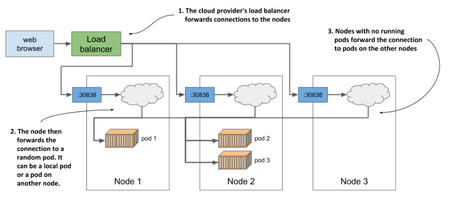

# Introduction to Kubernetes

## About Kubernetes

The word Kubernetes is **Greek for pilot or helmsman**, the person who steers the ship - the person standing at the helm (the ship’s wheel). A helmsman is not necessarily the same as a captain. A captain is responsible for the ship, while the helmsman is the one who steers it. Kubernetes steers your applications and reports on their status while you - the captain - decide where you want the system to go.

> HOW TO PRONOUNCE KUBERNETES AND WHAT IS K8S? The correct Greek pronunciation of Kubernetes, which is `Kie-ver-nee-tees`, is different from the English pronunciation you normally hear in technical conversations. Most often it’s `Koo-ber-netties` or `Koo-ber-nay’-tace`, but you may also hear `Koo-ber-nets`, although rarely. In both written and oral conversations, it’s also referred to as Kube or K8s, pronounced Kates, where the 8 signifies the number of letters omitted between the first and last letter.

**Kubernetes is a software system for automating the deployment and management of complex, large-scale application systems composed of computer processes running in containers.**

Main Kubernetes features:
- **Abstracting away the infrastructure**: When software developers or operators decide to deploy an application, they do this through Kubernetes instead of deploying the application to individual computers. Kubernetes provides an abstraction layer over the underlying hardware to both users and applications.

<!-- Source: https://livebook.manning.com/book/kubernetes-in-action-second-edition/chapter-1/v-14/17 -->
- **Standardizing how we deploy applications**: Because the details of the underlying infrastructure no longer affect the deployment of applications, you deploy applications to your corporate data center in the same way as you do in the cloud. A single manifest that describes the application can be used for local deployment and for deploying on any cloud provider. All differences in the underlying infrastructure are handled by Kubernetes, so you can focus on the application and the business logic it contains.
- **Deploying applications declaratively**: Kubernetes uses a declarative model to define an application. You describe the components that make up your application and Kubernetes turns this description into a running application. It then keeps the application healthy by restarting or recreating parts of it as needed. Whenever you change the description, Kubernetes will take the necessary steps to reconfigure the running application to match the new description. 

<!-- Source: https://livebook.manning.com/book/kubernetes-in-action-second-edition/chapter-1/v-14/17 -->

<!-- Source: https://livebook.manning.com/book/kubernetes-in-action-second-edition/chapter-1/v-14/17 -->
- **Taking on the daily management of applications**: As soon as you deploy an application to Kubernetes, it takes over the daily management of the application. If the application fails, Kubernetes will automatically restart it. The engineers responsible for operating the system can focus on the big picture instead of wasting time on the details. 

<!-- Source: https://livebook.manning.com/book/kubernetes-in-action-second-edition/chapter-1/v-14/17 -->

## Kubernetes history
Kubernetes was **originally developed by Google**. Google has practically always run applications in containers. As early as 2014, it was reported that **they start two billion containers every week**. That’s over **3,000 containers per second**, and the figure is much higher today (they run around 900,000 servers). They run these containers on thousands of computers distributed across dozens of data centers around the world.

- **About Borg and Omega - the predecessors of Kubernetes**: Over the years, Google developed an internal system called Borg (and later a new system called Omega) that helped both application developers and operators manage these thousands of applications and services.
- Based on the experience they gained while developing Borg, Omega and other internal systems, **in 2014 Google introduced Kubernetes, an open-source project** that can now be used and further improved by everyone.
- Several companies are now offering enterprise-quality Kubernetes products that are built from the open-source project. These include Red Hat OpenShift, Pivotal Container Service, Rancher and many others.
- Kubernetes has also spawned many other related open-source projects, most of which are now under the umbrella of the **Cloud Native Computing Foundation (CNCF)**, which is part of the Linux Foundation.
- CNCF organizes several **KubeCon** - CloudNativeCon conferences per year - in North America, Europe and China.
    - [CNCF [Cloud Native Computing Foundation]](https://www.youtube.com/c/cloudnativefdn): Videos form the conference

## Understanding Kubernetes
Kubernetes is a **platform for running containers**. It takes care of starting your containerized applications, rolling out updates, maintaining service levels, scaling to meet demand, securing access, and much more.

### Kubernetes is like an operating system for computer clusters

One can imagine Kubernetes as an operating system for the cluster. The next figure illustrates the analogies between an operating system running on a computer and Kubernetes running on a cluster of computers.

<!-- Source: https://livebook.manning.com/book/kubernetes-in-action-second-edition/chapter-1/v-14/17 -->

Just as an operating system supports the basic functions of a computer, such as scheduling processes onto its CPUs and acting as an interface between the application and the computer’s hardware, Kubernetes schedules the components of a distributed application onto individual computers in the underlying computer cluster and acts as an interface between the application and the cluster.

It frees application developers from the need to implement infrastructure-related mechanisms in their applications; instead, they rely on Kubernetes to provide them. This includes things like:
- **service discovery** - a mechanism that allows applications to find other applications and use the services they provide,
- **horizontal scaling** - replicating your application to adjust to fluctuations in load,
- **load-balancing** - distributing load across all the application replicas,
- **self-healing** - keeping the system healthy by automatically restarting failed applications and moving them to healthy nodes after their nodes fail,
- **leader election** - a mechanism that decides which instance of the application should be active while the others remain idle but ready to take over if the active instance fails.

By relying on Kubernetes to provide these features, application developers can focus on implementing the core business logic instead of wasting time integrating applications with the infrastructure.

### How Kubernetes fits into a computer cluster

You start with a fleet of machines that you divide into two groups - the master and the worker nodes. The master nodes will run the **Kubernetes Control Plane**, which represents the brain of your system and controls the cluster, while the rest will run your applications - your workloads - and will therefore represent the **Workload Plane**.

<!-- Source: https://livebook.manning.com/book/kubernetes-in-action-second-edition/chapter-1/v-14/17 -->

Non-production clusters can use a single master node, but highly available clusters use at least three physical master nodes to host the Control Plane. The number of worker nodes depends on the number of applications you’ll deploy.

### How all cluster nodes become one large deployment area

After Kubernetes is installed on the computers, **you no longer need to think about individual computers when deploying applications**. Regardless of the number of worker nodes in your cluster, they all become a single space where you deploy your applications. You do this using the Kubernetes API, which is provided by the Kubernetes Control Plane.

<!-- Source: https://livebook.manning.com/book/kubernetes-in-action-second-edition/chapter-1/v-14/17 -->

You can't deploy an extremely large application that is spread across several small machines. **Each application must be small enough to fit on one of the worker nodes**.

It doesn’t matter which worker node they end up on. Kubernetes may later even move the application from one node to another. You may not even notice when that happens, and you shouldn’t care.

## The benefits of using Kubernetes

### Self-service deployment of applications
Because Kubernetes presents all its worker nodes as a single deployment surface, it no longer matters which node you deploy your application to. This means that **developers can now deploy applications on their own**, even if they don’t know anything about the number of nodes or the characteristics of each node.

When a developer deploys an application, Kubernetes chooses the best node on which to run the application based on the resource requirements of the application and the resources available on each node.

### Reducing costs via better infrastructure utilization
Kubernetes may move an application to make room for a larger application that someone wants to deploy. This ability to move applications allows the applications to be packed tightly together so that the resources of the nodes can be utilized in the best possible way.

By combining different applications on the same machines, Kubernetes improves the utilization of your hardware infrastructure so you can run more applications on fewer servers.

### Automatically adjusting to changing load
Kubernetes can monitor the resources consumed by each application and other metrics and adjust the number of running instances of each application to cope with increased load or resource usage.

When you run Kubernetes on cloud infrastructure, it can even increase the size of your cluster by provisioning additional nodes through the cloud provider’s API. This way, you never run out of space to run additional instances of your applications.

### Keeping applications running smoothly
Kubernetes also makes every effort to ensure that your applications run smoothly. If your application crashes, Kubernetes will restart it automatically.

When a node fails, Kubernetes automatically moves applications to the remaining healthy nodes. The operations team no longer needs to manually move the application and can instead focus on repairing the node itself and returning it to the pool of available hardware resources.

### Simplifying application development
As mentioned previously, Kubernetes offers infrastructure-related services that would otherwise have to be implemented in your applications. This includes the discovery of services and/or peers in a distributed application, leader election, centralized application configuration and others. Kubernetes provides this while keeping the application Kubernetes-agnostic, but when required, applications can also query the Kubernetes API to obtain detailed information about their environment. They can also use the API to change the environment.

## Kubernetes architecture
A Kubernetes cluster consists of nodes divided into two groups:
- A set of **master nodes** that host the **Control Plane** components, which are the brains of the system, since they control the entire cluster.
- A set of **worker nodes** that form the **Workload Plane**, which is where your workloads (or applications) run.

<!-- Source: https://livebook.manning.com/book/kubernetes-in-action-second-edition/chapter-1/v-14/17 -->

The two planes, and hence the two types of nodes, run different Kubernetes components.

### Control Plane components
The Control Plane is what controls the cluster. It consists of several components that run on a single master node or are replicated across multiple master nodes to ensure high availability.

<!-- Source: https://livebook.manning.com/book/kubernetes-in-action-second-edition/chapter-1/v-14/17 -->

These are the components and their functions:
- The **Kubernetes API Server** exposes the RESTful Kubernetes API. Engineers using the cluster and other Kubernetes components create objects via this API.
- The **etcd** distributed datastore persists the objects you create through the API, since the API Server itself is stateless. The Server is the only component that talks to etcd.
- The **Scheduler** decides on which worker node each application instance should run.
- **Controllers** bring to life the objects you create through the API. Most of them simply create other objects, but some also communicate with external systems (for example, the cloud provider via its API).

The components of the Control Plane hold and control the state of the cluster, but they don’t run your applications. This is done by the (worker) nodes.

### Worker node components
The worker nodes are the computers on which your applications run. They form the cluster’s Workload Plane. In addition to applications, several Kubernetes components also run on these nodes. They perform the task of running, monitoring and providing connectivity between your applications. 

<!-- Source: https://livebook.manning.com/book/kubernetes-in-action-second-edition/chapter-1/v-14/17 -->

Each node runs the following set of components:
- The **Kubelet**, an agent that talks to the API server and manages the applications running on its node. It reports the status of these applications and the node via the API.
- The **Container Runtime**, which can be containerd or any other runtime compatible with Kubernetes. It runs your applications in containers as instructed by the Kubelet.
- The **Kubernetes Service Proxy (Kube Proxy)** load-balances network traffic between applications. Its name suggests that traffic flows through it, but that’s no longer the case.

> Kubernetes releases before v1.24 included a direct integration with Docker Engine, using a component named dockershim. That special direct integration is no longer part of Kubernetes (this removal was announced as part of the v1.20 release). [Check whether dockershim removal affects you](https://kubernetes.io/docs/tasks/administer-cluster/migrating-from-dockershim/check-if-dockershim-removal-affects-you/)

**Add-on components**

Most Kubernetes clusters also contain several other components. This includes a DNS server, network plugins, logging agents and many others. They typically run on the worker nodes but can also be configured to run on the master.

## Kubernetes versions

Kubernetes versions are expressed as x.y.z, where x is the major version, y is the minor version, and z is the patch version, following Semantic Versioning terminology. 

The Kubernetes project maintains release branches for the most recent three minor releases (1.30, 1.29, 1.28). Kubernetes 1.19 and newer receive approximately 1 year of patch support. Kubernetes 1.18 and older received approximately 9 months of patch support.

> [Version Skew Policy](https://kubernetes.io/releases/version-skew-policy/)

It is always recommended to upgrade the Kubernetes cluster to the latest available stable version. There are several techniques such as rolling updates, and node pool migrations that allow you to complete an update with minimal disruption and downtime.

<!-- Source: https://livebook.manning.com/book/kubernetes-in-action-second-edition/chapter-1/v-14/17 -->

## Install Kubernetes
If you want to run your applications on Kubernetes, you have to decide whether you want to run them **locally**, in your organization’s own infrastructure (on-premises) or with one of the major **cloud providers**, or perhaps both - in a **hybrid cloud solution**.

### Running Kubernetes on-premises
Running Kubernetes on your own infrastructure may be your only option if **regulations require** you to run applications on site. This usually means that you’ll have to manage Kubernetes yourself.

Kubernetes can run directly on your bare-metal machines or in virtual machines running in your data center. In either case, you won’t be able to scale your cluster as easily as when you run it in virtual machines provided by a cloud provider.

If you are considering introducing Kubernetes in your organization, the most important question you need to answer is whether you’ll manage Kubernetes yourself or use a Kubernetes-as-a-Service type offering where someone else manages it for you.
- **Managing Kubernetes yourself**:
    - If you ask anyone in the Kubernetes community if this is a good idea, you’ll usually get a very definite “no”.
    - Kubernetes brings with it an enormous amount of additional complexity. Anyone who wants to run a Kubernetes cluster must be intimately familiar with its inner workings.
    - The management of production-ready Kubernetes clusters is a multi-billion-dollar industry.
    - On the other hand, trying out Kubernetes for non-production use-cases or using a managed Kubernetes cluster is much less problematic.

The final question is whether to use a vanilla open-source version of Kubernetes or an extended, enterprise-quality Kubernetes product.
- **Using a vanilla version of Kubernetes**:
    - The open-source version of Kubernetes is maintained by the community and represents the cutting edge of Kubernetes development.
    - This also means that it may not be as stable as the other options. 
    - It may also lack good security defaults. 
    - Deploying the vanilla version requires a lot of fine tuning to set everything up for production use.

- **Using enterprise-grade Kubernetes distributions**:
    - A better option for using Kubernetes in production is to use an enterprise-quality Kubernetes distribution such as OpenShift or Rancher.
    - In addition to the increased security and performance provided by better defaults, they offer additional object types in addition to those provided in the upstream Kubernetes API.
    - These commercial Kubernetes distributions usually lag one or two versions behind the upstream version of Kubernetes. It’s not as bad as it sounds. The benefits usually outweigh the disadvantages.

Single node development Kubernetes options:
- [Docker Desktop](https://docs.docker.com/desktop/): which is a single package that gives you Docker and Kubernetes and all the command-line tools. Docker Desktop is supported on Windows 10 and macOS. 
- Single-node cluster on Linux machine or a Linux VM:
    - [**Kind**](https://kind.sigs.k8s.io/): kind is a tool for running local Kubernetes clusters using Docker container “nodes”. kind was primarily designed for testing Kubernetes itself, but may be used for local development or CI.
    - [**minikube**](https://minikube.sigs.k8s.io/docs/start/): minikube is local Kubernetes, focusing on making it easy to learn and develop for Kubernetes.
    - [**K3s**](https://docs.k3s.io/):
        - Lightweight Kubernetes. Easy to install, half the memory, all in a binary of less than 100 MB.
        - K3s is a fully compliant Kubernetes distribution.
        - The name is a play on “K8s,” which is an abbreviation of Kubernetes. K3s trims the Kubernetes codebase, and the name indicates that it’s half the size of K8s.

### Deploying Kubernetes in the cloud
If you have no on-premises infrastructure, you have no choice but to run Kubernetes in the cloud. This has the advantage that you can scale your cluster at any time at short notice if required. As mentioned earlier, Kubernetes itself can ask the cloud provider to provision additional virtual machines when the current size of the cluster is no longer sufficient to run all the applications you want to deploy.

When the number of workloads decreases and some worker nodes are left without running workloads, Kubernetes can ask the cloud provider to destroy the virtual machines of these nodes to reduce your operational costs. This **elasticity of the cluster is certainly one of the main benefits of running Kubernetes in the cloud.**

- **Using a managed Kubernetes cluster in the cloud**:
    - Using Kubernetes is ten times easier than managing it. 
    - Most major cloud providers now offer Kubernetes-as-a-Service. They take care of managing Kubernetes and its components while you simply use the Kubernetes API like any of the other APIs the cloud provider offers.

The top managed Kubernetes offerings include the following:
- Google Kubernetes Engine (GKE)
- Azure Kubernetes Service (AKS)
- Amazon Elastic Kubernetes Service (EKS)
- IBM Cloud Kubernetes Service
- Red Hat OpenShift Online and Dedicated
- VMware Cloud PKS
- Alibaba Cloud Container Service for Kubernetes (ACK)

### K3s installation
K3s provides an installation script that is a convenient way to install it as a service on systemd or openrc based systems. To install K3s using this method, just run:
- `curl -sfL https://get.k3s.io | K3S_KUBECONFIG_MODE="644" sh -`
- Check the version: `k3s --version`
- Run the following command to check that your cluster is up and running: `kubectl get nodes -o wide`
    - It’s a list of all the nodes in your cluster, with some basic details like the status and Kubernetes version.
- To verify your cluster is working: `kubectl cluster-info`
- [Quick-Start Guide](https://docs.k3s.io/quick-start)

## Should you even use Kubernetes?
- **Do your workloads require automated management?**
    - If your application is a large monolith, you definitely don’t need Kubernetes.
    - Even if you deploy microservices, using Kubernetes may not be the best option, especially if the number of your microservices is very small.
    - But if your system consists of less than five microservices, throwing Kubernetes into the mix is probably not a good idea.
    - If your system has more than twenty microservices, you will most likely benefit from the integration of Kubernetes.
- **Can you afford to invest your engineers’ time into learning Kubernetes?**
    - While the applications themselves don’t need to be modified to run in Kubernetes, development engineers will inevitably spend a lot of time learning how to use Kubernetes, even though the operators are the only ones that actually need that knowledge.
    - It would be hard to tell your teams that you’re switching to Kubernetes and expect only the operations team to start exploring it.
- **Are you prepared for increased costs in the interim?**
    - While Kubernetes reduces long-term operational costs, introducing Kubernetes in your organization initially involves increased costs for training, hiring new engineers, building and purchasing new tools and possibly additional hardware.
    - Kubernetes requires additional computing resources in addition to the resources that the applications use.
- **Don’t believe the hype**
    - The initial excitement has just begun to calm down, but many engineers may still be unable to make rational decisions about whether the integration of Kubernetes is as necessary as it seems.

## How Kubernetes runs an application

1. **Defining your application**:
    - Everything in Kubernetes is represented by an object.
    - You create and retrieve these objects via the Kubernetes API.
    - Your application consists of several types of these objects - one type represents the application deployment as a whole, another represents a running instance of your application, another represents the service provided by a set of these instances and allows reaching them at a single IP address, and there are many others.
    - These objects are usually defined in one or more manifest files in either YAML or JSON format.

> YAML was initially said to mean “Yet Another Markup Language”, but it was latter changed to the recursive acronym “YAML Ain’t Markup Language”. It’s one of the ways to serialize an object into a human-readable text file.
    

<!-- Source: https://livebook.manning.com/book/kubernetes-in-action-second-edition/chapter-1/v-14/17 -->

2. **Submitting the application to the API**:
    - After you’ve created your YAML or JSON file(s), you submit the file to the API, usually via the Kubernetes command-line tool called kubectl.
    > Kubectl is pronounced kube-control, but the softer souls in the community prefer to call it kube-cuddle. Some refer to it as kube-C-T-L.
    - Kubectl splits the file into individual objects and creates each of them by sending an HTTP PUT or POST request to the API, as is usually the case with RESTful APIs.
    - The API Server validates the objects and stores them in the etcd datastore. In addition, it notifies all interested components that these objects have been created.

These actions take place when you deploy the application:
- You submit the application manifest to the Kubernetes API. The API Server writes the objects defined in the manifest to etcd.
- A controller notices the newly created objects and creates several new objects - one for each application instance.
- The Scheduler assigns a node to each instance.
- The Kubelet notices that an instance is assigned to the Kubelet’s node. It runs the application instance via the Container Runtime.
- The Kube Proxy notices that the application instances are ready to accept connections from clients and configures a load balancer for them.
- The Kubelets and the Controllers monitor the system and keep the applications running.

## Deploying your first application

To interact with Kubernetes, you use a command-line tool called kubectl, pronounced `kube-control`, `kube-C-T-L` or `kube-cuddle`. The tool communicates with the Kubernetes API server, which is part of the Kubernetes Control Plane. The control plane then triggers the other components to do whatever needs to be done based on the changes you made via the API.

<!-- Source: https://livebook.manning.com/book/kubernetes-in-action-second-edition/chapter-3/v-14/152 -->

To see more detailed information about a node, you use the kubectl describe command, which shows much more: `kubectl describe node <NODE_NAME>`. It displays the status of the node, information about its CPU and memory usage, system information, containers running on the node, and much more.

Usually, to deploy an application, you’d prepare a JSON or YAML file describing all the components that your application consists of and apply that file to your cluster. This would be the **declarative approach**. We’ll use simple, one-line imperative commands to deploy your application.
- `cd Part_16_Introduction_to_Kubernetes/examples/test-app`
- `sudo docker build -t leon11sj/test-app .`
- `sudo docker push leon11sj/test-app`

Let’s deploy the application to your Kubernetes cluster. Here’s the command that does this:
- `kubectl create deployment test --image=leon11sj/test-app`

In the command, you specify three things:
- You want to create a deployment object.
- You want the object to be called test.
- You want the deployment to use the container image leon11sj/test-app.

By default, the image is pulled from Docker Hub, but you can also specify the image registry in the image name.

The **Deployment object** is now stored in the Kubernetes API. The existence of this object tells Kubernetes that the leon11sj/test-app container must run in your cluster. You’ve stated your desired state. Kubernetes must now ensure that the actual state reflects your wishes.

The interaction with Kubernetes consists mainly of the **creation and manipulation of objects via its API**. You can view the status by reading back the object.
- `kubectl get deployments`: The command lists all Deployment objects that currently exist in the cluster. You have only one Deployment in your cluster.

In Kubernetes, instead of deploying individual containers, you deploy groups of co-located containers – so-called **pods**. A pod is a group of one or more closely related containers. You can think of each pod as a separate logical computer that contains one application. 
- Listing pods: `kubectl get pods`
    - This is the pod that houses the container running your application.
If you simply want to see more information about the pod, you can also use the command: `kubectl describe pod <POD_NAME>`

<!-- Source: https://livebook.manning.com/book/kubernetes-in-action-second-edition/chapter-3/v-14/152 -->

Each pod gets its own IP address, but this address is internal to the cluster and not accessible from the outside. To make the pod **accessible externally, you’ll expose it by creating a Service object.**

A service with the type LoadBalancer provisions an external load balancer, which makes the service accessible via a public IP.
- Creating a Service: `kubectl expose deployment test --type=LoadBalancer --port 8080`

This is what running the above command tells Kubernetes:
- You want to expose all pods that belong to the test Deployment as a new service.
- You want the pods to be accessible from outside the cluster via a load balancer.
- The application listens on port 8080, so you want to access it via that port.

Listing services: `kubectl get svc`

The list shows two services with their types, IPs and the ports they expose. Ignore the kubernetes service for now and take a close look at the test service. 

<!-- Source: https://livebook.manning.com/book/kubernetes-in-action-second-edition/chapter-3/v-14/152 -->

The external IP is displayed. This means that the load balancer is ready to forward requests to your application for clients around the world. Open the webpage.

One of the major benefits of running applications in containers is the ease with which you can scale your application deployments. You’re currently running a single instance of your application. Imagine you suddenly see many more users using your application. The single instance can no longer handle the load. You need to run additional instances to distribute the load and provide service to your users. This is known as **scaling out**.
- Increasing the number of running application instances: `kubectl scale deployment test --replicas=5`

You’ve now told Kubernetes that you want to run five exact copies or replicas of your pod. Note that you haven’t instructed Kubernetes what to do. You haven’t told it to add two more pods. You just set the new desired number of replicas and let Kubernetes determine what action it must take to reach the new desired state.
- Seeing the results of the scale-out: `kubectl get deploy`
- You can confirm this by listing pods: `kubectl get pods -o wide`
- Try: `curl <IP>:<PORT>`

Each request arrives at a different pod in random order. This is what services in Kubernetes do when more than one pod instance is behind them. They act as load balancers in front of the pods. 

<!-- Source: https://livebook.manning.com/book/kubernetes-in-action-second-edition/chapter-3/v-14/152 -->

Remove the resources:
- `kubectl delete svc test`
- `kubectl delete deploy test`
- `kubectl get pods`

## Connect to the cluster from the local computer
- [Install kubectl on Windows and Create Kubeconfig File](https://www.virtualizationhowto.com/2021/06/install-kubectl-on-windows-and-create-kubeconfig-file/)
- [Cluster Access](https://docs.k3s.io/cluster-access)
- [Install and Set Up kubectl on Windows](https://kubernetes.io/docs/tasks/tools/install-kubectl-windows/)

The kubeconfig file stored at `/etc/rancher/k3s/k3s.yaml` is used to configure access to the Kubernetes cluster. If you have installed upstream Kubernetes command line tools such as kubectl or helm you will need to configure them with the correct kubeconfig path. This can be done by either exporting the `KUBECONFIG` environment variable or by invoking the `--kubeconfig` command line flag. Refer to the examples below for details.
