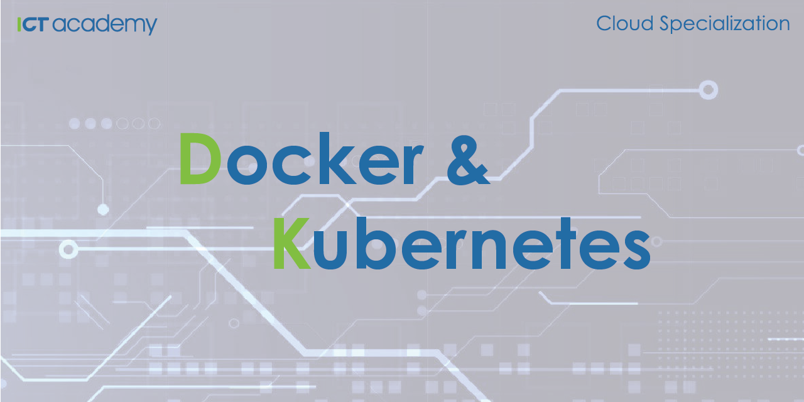

# Cloud Specialization: Docker & Kubernetes

  

    <em>Learn Docker and Kubernetes. Learn how to use Docker, Compose and Kubernetes on your machine for better software building and testing.</em>

---

**Live on-site course**: <a href="https://ict-academy.si/usposabljanje/prakticna-delavnica-docker-kubernetes/" target="_blank">https://ict-academy.si/usposabljanje/prakticna-delavnica-docker-kubernetes/</a>

**All courses**: <a href="https://ict-academy.si/" target="_blank">https://ict-academy.si/</a>

---

**What you'll learn**:
- Intro To Docker
- Containers
- Docker Images
- Docker Storage And Volumes
- Docker Networking
- Building Images
- Sharing Docker Images
- Running Multi-container Apps With Docker Compose
- Docker Reliability And Health Checks
- Managing Application Logs
- Monitoring And Management
- Docker Configuration Management
- Docker Security
- Advanced Docker
- Container orchestration and microservices
- Introduction to Kubernetes
- Kubernetes Pods
- Managing the lifecycle of the Pod

## Prerequisites
- Basic understanding of programming
- Basic Familiarity with the command line
- Basic Familiarity with Linux systems

## Full Course Outline

### [Part 1: Intro To Docker](./Part_01_Intro_To_Docker/README.md)
- Containers History
- Introduction to Containers
- Docker overview
- Installing Docker
- Running Hello World in a container
- Example: Running multiple NGINX instances
- Docker Architecture
- The Docker Engine (Advanced)

## [Part 2: Containers](./Part_02_Containers/README.md)
- Containers vs Virtual Machines
- What is a container?
- Starting a simple container
- Container processes
- Web server example
- Exploring the container filesystem and the container lifecycle
- Stopping containers gracefully

## [Part 3: Docker Images](./Part_03_Docker_Images/README.md)
- About Docker Images
- Pulling images
- Image registries
- Image naming and tagging
- Filtering the images on the host
- Images and layers
- Deleting Images

## Changes